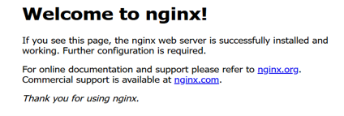
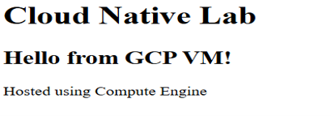

# Task 1 – Create a Production-Style Virtual Machine on Google Cloud

## Objective

Provision a Linux Virtual Machine (VM) on Google Cloud Compute Engine, configure firewall access, install and configure an NGINX web server, and host a custom static webpage.

## Real-World Scenario

A development team requires a Linux server on Google Cloud where:
- Developers can deploy applications.
- Backend services can be hosted.
- System logs can be monitored.
- Future cloud-native workloads can run.
As a Cloud Engineer, the objective is to provision the infrastructure and prepare the server for application hosting.

## Google Cloud Services Used

- Compute Engine
- Virtual Machine (Ubuntu)
- Firewall Rules (HTTP)
- SSH
- NGINX Web Server

## Implementation Steps

### Step 1 – Create a Virtual Machine

1. Create a new Google Cloud project.
2. Enable the **Compute Engine API**.
3. Navigate to:
Compute Engine → VM Instances → Create Instance

Configure the instance:
- Machine Type: **e2-micro**
- Boot Disk: **Ubuntu**
- Select the preferred Region and Zone.
- Enable **Allow HTTP Traffic**.
Click **Create**.

### Step 2 – Connect to the VM

Once the VM status changes to **Running**, connect using **SSH** from the Google Cloud Console.

### Step 3 – Update the Operating System

sudo apt update
Updates the package index to ensure the latest software versions are available.

### Step 4 – Install NGINX

sudo apt install nginx -y
NGINX is a lightweight and high-performance web server widely used in production environments, Kubernetes deployments, and reverse proxy configurations.

### Step 5 – Start the Web Server

sudo systemctl start nginx
Starts the NGINX service.

### Step 6 – Enable Automatic Startup

sudo systemctl enable nginx
Ensures NGINX automatically starts whenever the VM reboots.

### Step 7 – Verify Service Status

sudo systemctl status nginx
Confirm that the service is running successfully.
Press **Q** to exit the status screen.

### Step 8 – Verify the Default Website

Return to the **VM Instances** page.
Copy the VM's **External IP Address**.
Open it in a web browser.
Expected result: Welcome to nginx!

### Step 9 – Deploy a Custom Webpage

Navigate to the default web directory.
cd /var/www/html
Edit the homepage.
sudo nano index.html
Replace the existing content with:

<h1>Cloud Native Lab</h1>
<h2>Hello from GCP VM!</h2>

Hosted using Compute Engine

Save the file:
- Ctrl + O
- Enter
- Ctrl + X
Refresh the browser.
The custom webpage should now be displayed.

## Key Linux Commands Used

| Command | Purpose |
|----------|----------|
| `sudo` | Execute commands with administrator privileges |
| `apt update` | Refresh package repository information |
| `apt install` | Install software packages |
| `systemctl start` | Start a Linux service |
| `systemctl enable` | Start the service automatically after reboot |
| `systemctl status` | View the current service status |
| `nano` | Terminal-based text editor |

## Key Concepts Learned

### SSH (Secure Shell)

SSH provides secure remote access to Linux servers over the network and is the standard method for administering cloud-based virtual machines.

### NGINX

NGINX is a high-performance web server commonly used for:
- Static website hosting
- Reverse proxy
- Load balancing
- Kubernetes Ingress Controllers

### Linux Directory Structure

The default web root for NGINX is:
/var/www/html

Where:
- `/var` → Variable application data
- `/www` → Web server files
- `/html` → Website content

### Common Network Ports

| Port | Service |
|------:|---------|
| 22 | SSH |
| 80 | HTTP |
| 443 | HTTPS |
| 3306 | MySQL |

## Outcome

Successfully provisioned an Ubuntu Virtual Machine on Google Cloud, installed and configured NGINX, and deployed a custom static webpage accessible through the VM's public IP address.

## Screenshots

