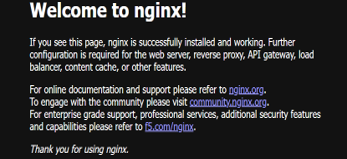
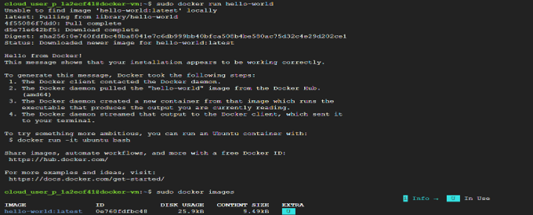
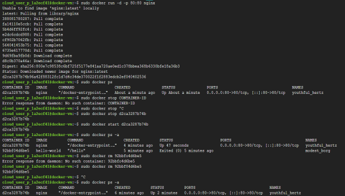

# Task 5 – Docker, Containerization & Container Fundamentals

## Objective

Install Docker on a Google Cloud Virtual Machine, understand containerization, run and manage containers, and explore the concepts of Docker Images, Containers, and Container Registries.

## Real-World Scenario

A common challenge in software development is: "The application works on my laptop but fails on the server."
This usually happens because different environments have:
- Different operating systems
- Missing dependencies
- Conflicting library versions
- Different runtime configurations
Modern cloud-native applications solve this problem using **containers**, ensuring applications behave consistently across development, testing, and production environments.

## Google Cloud Services Used

- Compute Engine
- Docker Engine
- Docker Hub
- Containerization

## Implementation Steps

### Step 1 – Create a Virtual Machine

Create a new Ubuntu Virtual Machine with the following configuration:
- Machine Type: **e2-medium**
- Allow **HTTP Traffic**
> **Note:** Docker containers require more resources than the earlier VM exercises, making `e2-medium` a better choice for this lab.

### Step 2 – Connect Using SSH

Open an SSH session to the VM.

### Step 3 – Install Docker

Update the package repository.
sudo apt update
Install Docker.
sudo apt install docker.io -y
This installs:
- Docker Engine
- Container Runtime
- Required supporting packages

### Step 4 – Start Docker

Start the Docker service.
sudo systemctl start docker
Enable Docker to start automatically after every reboot.
sudo systemctl enable docker
Verify the service status.
sudo systemctl status docker
Expected result: active (running)

### Step 5 – Verify Docker Installation

Check the installed Docker version.
sudo docker version
This confirms both the Docker Client and Docker Engine are installed correctly.

### Step 6 – Run Your First Container

Run the Hello World container.
sudo docker run hello-world
Docker automatically:
- Checks the local image cache.
- Downloads the image from Docker Hub (if not present).
- Creates a container.
- Executes the application.
- Displays the output.
- Stops the container.

### Step 7 – View Local Images

sudo docker images
This displays all Docker images currently stored on the VM.

### Step 8 – Run an NGINX Container

Start an NGINX container.
sudo docker run -d -p 80:80 nginx
Open the VM's **External IP Address** in a web browser.
Expected result: The default **NGINX Welcome Page** should be displayed.
he web server is running **inside the container**, not directly on the Virtual Machine.

### Step 9 – Manage Containers

View running containers.
sudo docker ps
Stop a container.
sudo docker stop CONTAINER_ID
Start a stopped container.
sudo docker start CONTAINER_ID
View all containers.
sudo docker ps -a
Remove a container.
sudo docker rm CONTAINER_ID
Remove an image.
sudo docker rmi nginx
View Docker-related processes.
ps aux | grep docker

## Key Concepts Learned

### Containerization

A container packages everything an application requires to run, including:
- Application code
- Runtime
- Libraries
- Dependencies
- Configuration files
Because everything is packaged together, the application behaves consistently across different environments.

### Why Containers?

Without containers, applications may fail because of:
- Missing software
- Different runtime versions
- Dependency conflicts
Containers eliminate these issues by packaging the application together with its required environment.

### Docker

Docker is the industry's most widely used container platform. It allows developers to:
- Build containers
- Run containers
- Distribute containers
- Manage containerized applications

### Docker Engine

Docker Engine is the core software responsible for running containers. Its responsibilities include:
- Creating containers
- Managing images
- Networking
- Storage management
When the Docker service shows: active (running)
the Docker daemon is actively managing containers on the system.

### Daemon

A daemon is a background service that continuously runs and performs system tasks. Examples include:
- Docker daemon
- NGINX service
- Database services

### Docker Images

A Docker Image is a read-only template used to create containers. It contains:
- Application code
- Runtime
- Libraries
- Dependencies
Think of an Image as a blueprint, while a Container is the running instance created from that blueprint.

### Docker Hub

Docker Hub is a public container registry where developers publish and download container images. When running:
sudo docker run hello-world
Docker performs the following workflow:
Check Local Image --> Image Not Found --> Download from Docker Hub --> Create Container --> Run Container --> Display Output

### Local Image Cache

Running: sudo docker images
displays the local image cache stored on the machine.
Previously downloaded images are reused instead of being downloaded again.

### Port Mapping

The following command: sudo docker run -d -p 80:80 nginx
maps: Host Port : Container Port. Example: 80 : 80
Traffic flow: Internet --> VM Port 80 --> Container Port 80 --> NGINX
ontainers have isolated networking, and port mapping exposes container services to external users.

### Containers vs Virtual Machines

| Virtual Machine | Container |
|-----------------|-----------|
| Includes a complete guest operating system | Shares the host operating system kernel |
| Larger in size | Lightweight |
| Slower startup | Starts within seconds |
| Higher resource usage | Lower resource usage |

### Container Registries

A Container Registry stores Docker Images. Common registries include:
| Registry | Platform |
|-----------|----------|
| Docker Hub | Public |
| Artifact Registry | Google Cloud |
| Amazon ECR | AWS |
Typical workflow: Developer -> Build Image -> Push to Registry -> Production Pulls Image -> Run Container

### Artifact Registry

Artifact Registry is Google Cloud's managed service for storing:
- Docker Images
- Packages
- Build Artifacts

### Containers and Kubernetes

Kubernetes does not execute source code directly.
Instead, it deploys and manages **containers**, making containerization the foundation of Kubernetes-based applications.

### Detached Mode

Running a container without: -d
keeps the terminal attached to the running process.
Using: -d
starts the container in the background, allowing the terminal to be used for other commands.

### Why Cloud-Native Systems Use Containers

Containers are ideal for modern cloud applications because they are:
- Portable
- Lightweight
- Fast to start
- Consistent across environments
- Easy to scale
- Well integrated with CI/CD pipelines

## Outcome

Successfully installed Docker on a Google Cloud Virtual Machine, deployed and managed containers, explored Docker Images and Docker Hub, and gained a strong understanding of containerization fundamentals used in modern cloud-native applications.

## Skills Practiced

- Docker
- Containerization
- Docker Engine
- Docker Hub
- Container Management
- Linux Administration
- Compute Engine

## Screenshots

