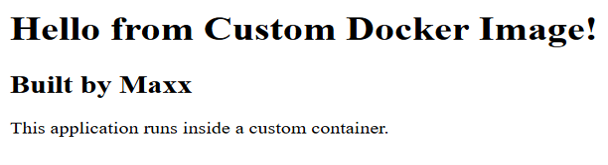
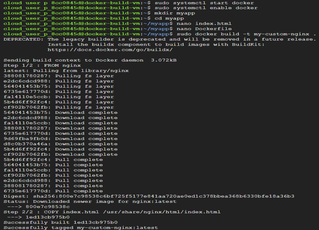
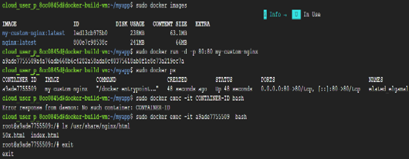

# Task 6 – Build a Custom Docker Image Using Dockerfile

## Objective

Create a custom Docker image by writing a Dockerfile, build and run the image on Google Cloud, and understand Docker image layers, container filesystems, and image management workflows.

## Real-World Scenario

In the previous task, existing Docker images such as **NGINX** were used to run containers.
In real-world cloud-native development, engineers typically build their own Docker images for applications such as:
- Java Spring Boot applications
- Node.js APIs
- Python Flask applications
- React frontends
The objective of this lab is to create a custom application, package it into a Docker image, and run it as a container.

## Google Cloud Services Used
- Compute Engine
- Docker Engine
- Dockerfile
- Docker Images
- Containerization

## Implementation Steps

### Step 1 – Create a Virtual Machine

Create a new Ubuntu Virtual Machine with the following configuration:
- Machine Type: **e2-medium**
- Allow **HTTP Traffic**
Connect to the VM using SSH.

### Step 2 – Install Docker

Update the package repository | sudo apt update

Install Docker | sudo apt install docker.io -y

Start the Docker service | sudo systemctl start docker

Enable Docker to start automatically after reboot | sudo systemctl enable docker

### Step 3 – Create the Project Directory

Create a project folder.

mkdir myapp | 
cd myapp

### Step 4 – Create the Application

Create a new HTML file | nano index.html

Paste the following content:

```
<!DOCTYPE html>
<html>
<head>
   <title>My Custom Docker App</title>
</head>
<body>
   <h1>Hello from Custom Docker Image!</h1>
   <h2>Built by Maxx</h2>
   <p>This application runs inside a custom container.</p>
</body>
</html>
```

Save the file.

### Step 5 – Create a Dockerfile

Create a Dockerfile | nano Dockerfile

Add the following instructions:

FROM nginx
COPY index.html /usr/share/nginx/html/index.html

Save the file.

### Step 6 – Build the Docker Image

Run the following command | sudo docker build -t my-custom-nginx .

The `.` indicates that Docker should use the current directory as the build context.

### Step 7 – Verify the Image

List the available Docker images | sudo docker images

Confirm that the newly created image appears in the list.

### Step 8 – Run the Custom Container

Start a container using the custom image | sudo docker run -d -p 80:80 my-custom-nginx

Open the VM's **External IP Address** in a web browser. Expected result: The custom HTML webpage should be displayed.

### Step 9 – Inspect the Running Container

View the running containers | sudo docker ps

Observe:
- Container ID
- Image Name
- Port Mapping
- Status

### Step 10 – Access the Container

Open an interactive shell inside the running container | sudo docker exec -it CONTAINER_ID bash

Verify the application files | ls /usr/share/nginx/html

The custom `index.html` file should be present.

Exit the container shell | exit

## Key Concepts Learned

### Dockerfile

A Dockerfile is a text file containing instructions used to build Docker images. It defines:
- Base image
- Files to copy
- Commands to execute
- Application startup configuration

Instead of manually configuring every container, Docker automatically follows these instructions during the image build process.

### Building Docker Images

When Docker processes a Dockerfile, it creates a reusable image that packages the application together with its runtime environment.
The resulting image can be deployed consistently across multiple environments.

### Understanding the Dockerfile

The following Dockerfile was used:

FROM nginx
COPY index.html /usr/share/nginx/html/index.html

**FROM**
Uses the official NGINX image as the base image.
Instead of installing Linux and NGINX manually, Docker reuses an existing trusted image.

**COPY**
Copies the local `index.html` file into the container's default NGINX web directory.
/usr/share/nginx/html | 
This replaces the default NGINX homepage with the custom webpage.

### Building an Image

The command: sudo docker build -t my-custom-nginx. can be interpreted as:
| Component | Description |
|-----------|-------------|
| `docker build` | Builds a Docker image |
| `-t` | Assigns a name (tag) to the image |
| `my-custom-nginx` | Image name |
| `.` | Uses the current directory as the build context |

### Docker Image Layers

Each instruction within a Dockerfile creates a separate image layer. Layering improves efficiency by allowing Docker to reuse unchanged layers during future builds.
For example: If only `index.html` changes, Docker reuses the existing NGINX layer and rebuilds only the modified layer.
This results in faster builds and reduced storage usage.

### Container Filesystem

Containers have an isolated filesystem. Files copied during the image build process exist inside the container rather than directly on the host Virtual Machine.

### Image Tagging

Docker images can be versioned using tags. Examples:
- `myapp:v1`
- `myapp:v2`
- `myapp:latest`

Image tagging simplifies:

- Version management
- Rollbacks
- Production deployments

### Security Best Practices

Sensitive information should never be stored inside Docker images. Avoid embedding:
- Passwords
- API Keys
- Secrets

Instead, production environments typically use:
- Google Secret Manager
- Kubernetes Secrets
- Environment Variables

### Base Images

Selecting trusted base images is an important security practice.

Official and regularly updated images reduce the risk of:
- Malware
- Known vulnerabilities
- Outdated software

Organizations commonly scan container images before deployment to identify potential security risks.

## Outcome

Successfully created a custom Docker image using a Dockerfile, built and executed the image on Google Cloud, explored container internals, and gained practical experience with Docker image creation and container management.

## Skills Practiced
- Docker
- Dockerfile
- Docker Images
- Containerization
- Compute Engine
- Image Building
- Container Management

## Screenshots






