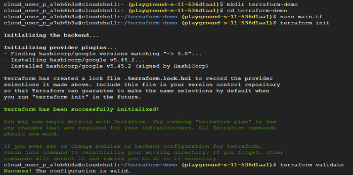
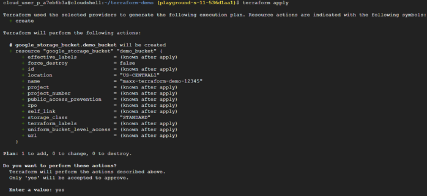
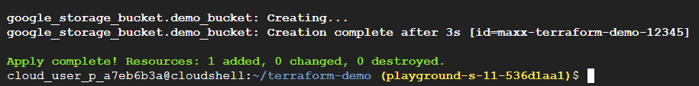
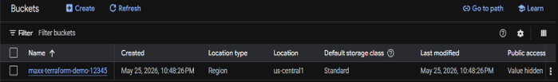
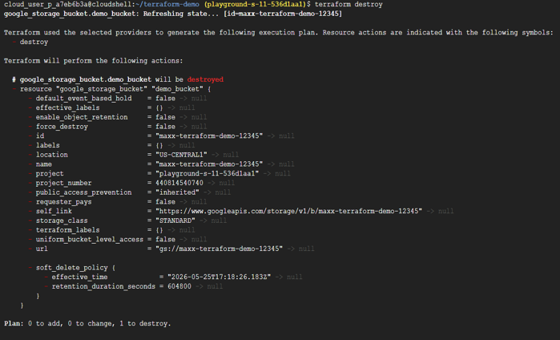
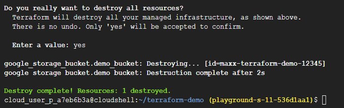

# Task 11 – Infrastructure as Code (IaC) with Terraform

## Objective

Learn the fundamentals of Infrastructure as Code (IaC) using Terraform by provisioning cloud resources through code instead of manually configuring infrastructure through the Google Cloud Console.

## Real-World Scenario

Modern cloud environments often contain:
- Hundreds of Virtual Machines
- Storage Buckets
- Virtual Private Clouds (VPCs)
- Kubernetes Clusters
- Firewall Rules

Managing this infrastructure manually through a graphical interface becomes inefficient and error-prone.
To solve this problem, organizations define infrastructure using code, allowing environments to be created, modified, and destroyed consistently through automation.

## Google Cloud Services Used

- Terraform
- Cloud Shell
- Google Cloud Storage
- Infrastructure as Code (IaC)

## Implementation Steps

### Step 1 – Open Cloud Shell

Launch **Cloud Shell** from the Google Cloud Console.

### Step 2 – Verify Terraform Installation

Check whether Terraform is available in the environment | terraform version

### Step 3 – Create a Working Directory

Create a new directory for the Terraform project.

mkdir terraform-demo
cd terraform-demo

### Step 4 – Create the Terraform Configuration

Create the main Terraform configuration file | nano main.tf

Paste the following configuration.

Replace `PROJECT_ID` with your Google Cloud Project ID and ensure the bucket name is globally unique.

```
terraform {
  required_providers {
               google = {
		    source  = "hashicorp/google"
		    version = "~> 5.0"
	       }
   }
}
provider "google" {
        project = "PROJECT_ID"
        region  = "us-central1"
}
resource "google_storage_bucket" "demo_bucket" {
	name = "maxx-terraform-demo-12345"
	location = "US-CENTRAL1"
}

```
Save the file.

### Step 5 – Initialize Terraform

Initialize the working directory | terraform init

Terraform downloads the required provider plugins and prepares the environment for deployment.

### Step 6 – Validate the Configuration

Verify the syntax of the Terraform configuration | terraform validate

Successful validation confirms that the configuration is syntactically correct.

### Step 7 – Preview Infrastructure Changes

Generate an execution plan | terraform plan

Terraform displays the infrastructure changes that will be made without creating any resources.

### Step 8 – Provision the Infrastructure

Apply the configuration | terraform apply

When prompted, enter: yes | Terraform provisions the Storage Bucket by communicating directly with Google Cloud APIs.

### Step 9 – Verify the Resource

Navigate to: Cloud Storage → Buckets

Confirm that the Storage Bucket has been successfully created.

### Step 10 – Observe Terraform State

List the files created by Terraform | ls

Observe the generated Terraform state files.

### Step 11 – Destroy the Infrastructure

Delete the resources created by Terraform | terraform destroy

Confirm the operation when prompted. This removes the infrastructure defined in the configuration.

## Key Concepts Learned

### Infrastructure as Code (IaC)

Infrastructure as Code (IaC) is the practice of defining and managing infrastructure using configuration files instead of manual processes. IaC enables infrastructure to be:
- Automated
- Repeatable
- Version-controlled
- Consistently deployed

### Terraform

Terraform is an open-source Infrastructure as Code tool developed by HashiCorp. It provisions and manages cloud infrastructure by communicating directly with cloud provider APIs.
Terraform itself does **not** host infrastructure—it automates the creation and management of cloud resources.

### Declarative Infrastructure

Terraform follows a declarative approach. Instead of defining each individual step, you describe the desired end state. For example, rather than specifying:
- Create a Virtual Machine
- Attach a Disk
- Configure Networking

you simply define the desired infrastructure, and Terraform determines how to achieve that state.

### Terraform Configuration Files

Terraform configurations are stored in files with the `.tf` extension. These files describe the infrastructure Terraform should provision and manage.

### Providers

A Provider is a plugin that allows Terraform to communicate with a specific cloud platform or service. In this lab, the Google Provider enables Terraform to provision resources on Google Cloud Platform.

### Resources

A Resource represents an infrastructure component managed by Terraform. Examples include:
- Virtual Machines
- Storage Buckets
- Networks
- Firewall Rules
- Databases

Each resource is declared within the Terraform configuration.

### Terraform Initialization

The command: terraform init
performs several initialization tasks:
- Downloads provider plugins
- Prepares the working directory
- Configures the Terraform environment

Terraform providers are downloaded dynamically as needed.

### Terraform Plan

The command: terraform plan

generates a preview of the infrastructure changes before they are applied. This allows engineers to review proposed modifications before making changes to production environments.

### Terraform Apply

The command: terraform apply

creates or updates infrastructure by executing the planned changes through the Google Cloud APIs.

### Terraform State

Terraform maintains a state file that records the current infrastructure managed by Terraform. The state file enables Terraform to compare:
- Desired configuration
- Current infrastructure

This comparison allows Terraform to determine what changes are required during future executions.

### Idempotency

Terraform is idempotent. Running the same configuration multiple times produces the same desired infrastructure state without creating duplicate resources.
This ensures predictable and reliable infrastructure management.

### Terraform Destroy

The command: terraform destroy

removes all resources defined within the Terraform configuration. Cleaning up unused infrastructure is an important cloud engineering practice because it helps reduce:
- Unnecessary costs
- Resource clutter
- Governance and compliance issues

## Outcome

Successfully provisioned and managed Google Cloud infrastructure using Terraform, explored Infrastructure as Code principles, validated configurations, reviewed execution plans, tracked infrastructure state, and safely destroyed cloud resources through code.

## Skills Practiced

- Terraform
- Infrastructure as Code (IaC)
- Google Cloud Storage
- Cloud Automation
- Cloud Shell
- Declarative Infrastructure
- Infrastructure Provisioning

## Screenshots













