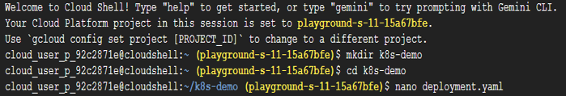
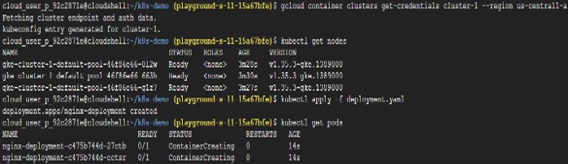
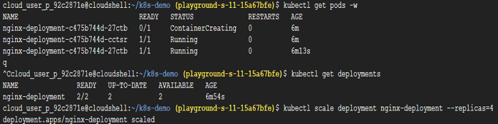
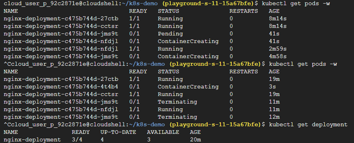
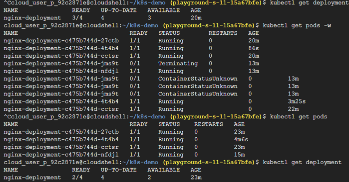
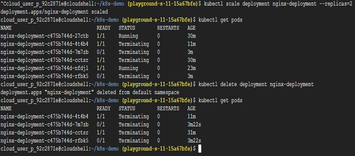

# Task 12 – Kubernetes Workloads, Scaling & Self-Healing

## Objective

Deploy a Kubernetes application using a declarative YAML manifest, manage workloads with Deployments, perform horizontal scaling, and understand Kubernetes' self-healing capabilities.

## Real-World Scenario

Organizations commonly deploy:
- REST APIs
- Frontend applications
- Microservices
- Background workers

As applications grow, several operational challenges arise:
- What happens if a container crashes?
- How can the application handle increased traffic?
- How are updates performed without downtime?
- How are multiple application replicas managed?

Kubernetes addresses these challenges through automated container orchestration.

## Google Cloud Services Used

- Google Kubernetes Engine (GKE)
- Kubernetes
- Cloud Shell
- kubectl

## Implementation Steps

### Step 1 – Create a Kubernetes Cluster

Navigate to: Kubernetes Engine | Create a new cluster using the desired specifications while keeping the remaining settings at their default values.

### Step 2 – Open Cloud Shell

Launch **Cloud Shell** from the Google Cloud Console. Create a working directory.

mkdir k8s-demo
cd k8s-demo

### Step 3 – Create the Deployment Manifest

Create a Kubernetes manifest | nano deployment.yaml

Paste the following configuration.
```
apiVersion: apps/v1
kind: Deployment
metadata: 
    name: nginx-deployment
spec: 
    replicas: 2
selector: 
    matchLabels:
        app: nginx
template: 
    metadata: 
        labels: 
           app: nginx
spec: 
    containers: 
        - name: nginx-container 
          image: nginx 
          ports: 
           - containerPort: 80
```

Save the file.

### Step 4 – Connect to the Cluster

Configure `kubectl` to communicate with the Kubernetes cluster | gcloud container clusters get-credentials CLUSTER_NAME --region REGION

Replace:
- `CLUSTER_NAME`
- `REGION`

with the values used during cluster creation.

### Step 5 – Verify Cluster Connectivity

Confirm that the cluster is reachable | kubectl get nodes

All nodes should report the **Ready** status.

### Step 6 – Deploy the Application

Apply the deployment manifest | kubectl apply -f deployment.yaml

Verify that the Pods have been created | kubectl get pods

To observe changes in real time, use: kubectl get pods -w | Press **Ctrl + C** to exit live monitoring.

Verify the Deployment | kubectl get deployments

At this point, Kubernetes automatically creates and manages the application Pods defined in the manifest.

### Step 7 – Scale the Deployment

Increase the number of application replicas | kubectl scale deployment nginx-deployment --replicas=4

Verify the updated Pod count | kubectl get pods

To reduce the number of replicas, repeat the command with a smaller replica value.

## Sandbox Observation
> **Note:** After applying the deployment, Pods may take several minutes to become fully operational while Kubernetes schedules workloads and pulls container images.

> **Additional Observation:** Kubernetes continuously maintains the desired application state. If a Pod is deleted or unexpectedly terminates, the Deployment automatically creates a replacement Pod to restore the desired replica count.

> **Resource Limitation:** During this lab, an **e2-micro** node configuration was used. Due to limited CPU and memory resources, additional Pods repeatedly entered a pending or failed state when scaling to four replicas. Using a larger machine type (such as **e2-medium**) provides sufficient resources for successful scaling.

## Key Concepts Learned

### Kubernetes Workloads

Kubernetes is more than a platform for running containers. It automatically manages:
- Container deployment
- Scaling
- Monitoring
- Recovery
- Updates

This orchestration allows applications to remain highly available with minimal manual intervention.

### Pods

A Pod is the smallest deployable unit in Kubernetes. A Pod typically contains:
- One application container
- Networking configuration
- Storage context

Containers do not run directly within Kubernetes—they always execute inside Pods.

### Deployments

A Deployment is a Kubernetes controller responsible for managing Pods. It ensures:
- Desired replica count
- Rolling updates
- Automatic recovery
- Application availability

In production environments, Pods are typically managed through Deployments rather than being created directly.

### Desired State

Kubernetes follows a declarative model. Instead of defining every operational step, engineers specify the desired end state.
For example: Replicas: 4 | Kubernetes continuously monitors the cluster and automatically works to maintain four healthy Pods.

### Self-Healing

Self-healing is one of Kubernetes' core capabilities. If a Pod crashes, fails, or is deleted, Kubernetes automatically creates a replacement Pod to restore the desired application state.
This process occurs without manual intervention.

### Kubernetes Manifests

Infrastructure and workloads in Kubernetes are commonly defined using declarative YAML manifests. These files describe how Kubernetes should deploy and manage application resources.

### Manifest Components

**apiVersion**
Specifies the Kubernetes API version responsible for the resource. Example: apps/v1

**kind**
Defines the resource type. Example: Deployment

**metadata**
Contains identifying information such as:
- Resource name
- Labels
- Identifiers

**replicas**
Specifies the number of Pod instances Kubernetes should maintain. Example: replicas: 2

**selector**
Determines which Pods belong to the Deployment.

**template**
Acts as the blueprint Kubernetes uses when creating new Pods.

**image**
Specifies the container image that should be executed. Example: image: nginx

### kubectl

`kubectl` is the command-line client used to manage Kubernetes clusters. Common commands include:
| Command | Purpose |
|---------|----------|
| `kubectl apply` | Create or update resources |
| `kubectl get pods` | List running Pods |
| `kubectl describe` | Display detailed resource information |
| `kubectl logs` | View container logs |
| `kubectl delete` | Remove Kubernetes resources |
`kubectl` communicates with the Kubernetes API Server to manage cluster resources.

### Connecting kubectl to GKE

The command: gcloud container clusters get-credentials CLUSTER\_NAME --region REGION

downloads the cluster's authentication and endpoint information into the local kubeconfig file.
Without this configuration, `kubectl` cannot communicate with the Kubernetes cluster.

## Outcome

Successfully deployed an application using a Kubernetes Deployment manifest, managed application replicas declaratively, explored horizontal scaling, and observed Kubernetes' automatic self-healing capabilities while gaining practical experience with workload orchestration.

## Skills Practiced

- Kubernetes
- Google Kubernetes Engine (GKE)
- Deployments
- Pods
- kubectl
- YAML
- Horizontal Scaling
- Self-Healing
- Container Orchestration

## Screenshots














