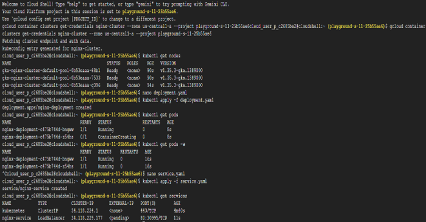
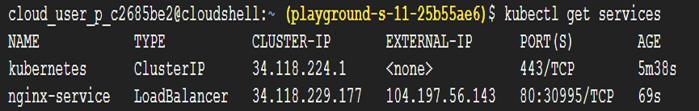
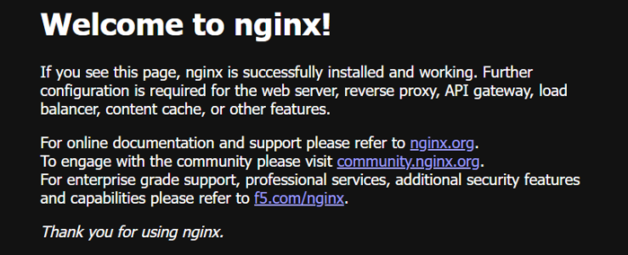
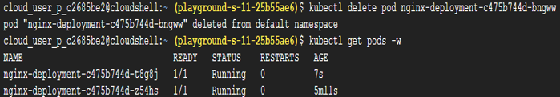
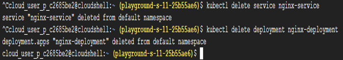

# Task 13 – Kubernetes Services, Internal Networking & Load Balancing

## Objective

Deploy a Kubernetes application, expose it using a Kubernetes Service, provision an external Load Balancer, and understand how Kubernetes provides stable networking for applications.

## Real-World Scenario

After deploying applications with Kubernetes Deployments, a major challenge remains: Pods are temporary. They can:
- Crash
- Restart
- Be recreated
- Receive new IP addresses

Users cannot reliably connect directly to Pod IPs. To provide consistent access, Kubernetes uses **Services**, which offer stable networking and load balancing for application workloads.

## Google Cloud Services Used

- Google Kubernetes Engine (GKE)
- Kubernetes Services
- Cloud Load Balancer
- Cloud Shell
- kubectl

## Implementation Steps

### Step 1 – Create a Kubernetes Cluster

Navigate to: Kubernetes Engine | Create a new cluster using an **e2-small** machine configuration.

### Step 2 – Connect to the Cluster

Open **Cloud Shell** and connect `kubectl` to the cluster | gcloud container clusters get-credentials CLUSTER_NAME --region REGION

Replace:
- `CLUSTER_NAME`
- `REGION`

with your cluster details. 

Verify the connection | kubectl get nodes

### Step 3 – Create the Deployment

Create the deployment manifest | nano deployment.yaml

Paste the following configuration.
```
apiVersion: apps/v1
kind: Deployment
metadata:
      name: nginx-deployment
spec: 
      replicas: 2
selector:
    matchLabels:
         app: nginx
template:
     metadata:
        labels:
           app: nginx
spec:
   containers:
         - name: nginx-container
           image: nginx
           ports:
	 	- containerPort: 80
```

Save the file. 

Deploy the application | kubectl apply -f deployment.yaml

Verify that the Pods are running | kubectl get pods

### Step 4 – Create the Kubernetes Service

Create a Service manifest | nano service.yaml

Paste the following configuration.
```
apiVersion: v1
kind: Service
metadata:
    name: nginx-service
spec:
    selector:
       app: nginx
ports:
    - protocol: TCP
      port: 80
      targetPort: 80
type: LoadBalancer
```

Save the file. 

Apply the Service | kubectl apply -f service.yaml

View the Service | kubectl get services

Wait until an **External IP** is assigned. Open the External IP in a browser to access the deployed application.

### Step 5 – Observe the Network Flow

After the Service is created, traffic flows through the following path:
User -> Cloud Load Balancer -> Kubernetes Service -> Application Pods

The Service provides a stable endpoint while distributing incoming traffic across healthy Pods.

### Step 6 – Test Self-Healing

Delete one of the running Pods | kubectl delete pod POD_NAME

Observe the Pods again | kubectl get pods

The Deployment automatically creates a replacement Pod while the Service continues routing traffic without interruption.

### Step 7 – Clean Up

Delete the Service | kubectl delete service nginx-service

Delete the Deployment | kubectl delete deployment nginx-deployment

Finally, delete the Kubernetes cluster from: Kubernetes Engine → Clusters

## Key Concepts Learned

### Deployments vs Services

Deployments and Services serve different purposes within Kubernetes.

**Deployment**

Responsible for:
- Managing application lifecycle
- Maintaining replicas
- Rolling updates
- Self-healing

**Service**

Responsible for:
- Network access
- Stable connectivity
- Load balancing
- Service discovery

### Why Services Are Required

Pods are **ephemeral**, meaning they can be recreated at any time and receive new IP addresses. Users should never connect directly to Pods.
Instead, applications are accessed through Kubernetes Services, which provide a permanent network endpoint.

### Kubernetes Service

A Kubernetes Service is a stable networking layer that sits in front of application Pods. It:
- Provides a stable IP and DNS name
- Automatically discovers healthy Pods
- Load balances incoming traffic
- Continues working even when Pods restart

### Understanding the Service Manifest

The Service configuration defines how traffic reaches the application.

**selector**
selector:
	app: nginx
Matches Pods based on their labels. Only matching Pods receive traffic.

**port**

port: 80
The port exposed by the Service.

**targetPort**
targetPort: 80

The container port that receives incoming requests.

**type: LoadBalancer**

type: LoadBalancer | 
Instructs Google Kubernetes Engine to provision an external Cloud Load Balancer and assign a public IP address.

### What Happens Internally

When the Service is applied:
- Kubernetes creates the Service object.
- Google Kubernetes Engine provisions an external Cloud Load Balancer.
- A public IP address is allocated.
- Incoming traffic is distributed across healthy Pods.

Kubernetes integrates directly with cloud provider APIs to automate network resource provisioning.

### Self-Healing with Services

Deleting a Pod does not interrupt application availability. The Deployment automatically recreates the missing Pod while the Service redirects traffic to the remaining healthy Pods.
This combination provides resilient application networking.

### Types of Kubernetes Services

**ClusterIP**
- Default Service type
- Internal cluster communication
- Commonly used for backend APIs and databases

**NodePort**
- Exposes the application through a node's IP address and port
- Primarily used for development and testing

**LoadBalancer**
- Creates an external cloud-managed load balancer
- Commonly used for production workloads

**ExternalName**
- Maps a Service to an external DNS name

### Service Discovery

Services enable applications within the cluster to communicate using stable DNS names instead of changing Pod IP addresses. Example:
http://backend-service

This allows frontend applications to consistently communicate with backend services regardless of Pod restarts.

### Cloud-Native Benefits

Using Kubernetes Services enables applications to become:
- Highly available
- Loosely coupled
- Fault tolerant
- Scalable
- Easier to maintain

## Outcome

Successfully deployed an application to Google Kubernetes Engine, exposed it using a Kubernetes Service, provisioned an external Cloud Load Balancer, verified public application access, and explored Kubernetes networking, service discovery, load balancing, and self-healing capabilities.

## Skills Practiced

- Kubernetes
- Google Kubernetes Engine (GKE)
- Kubernetes Services
- Cloud Load Balancing
- Service Discovery
- Internal Networking
- kubectl
- YAML
- Container Orchestration

## Screenshots











