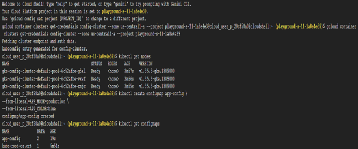
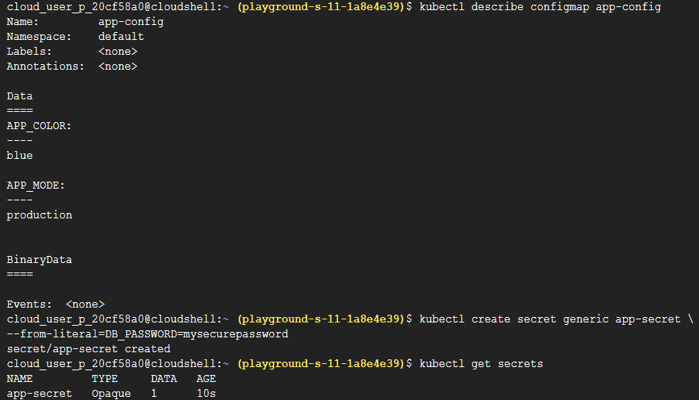
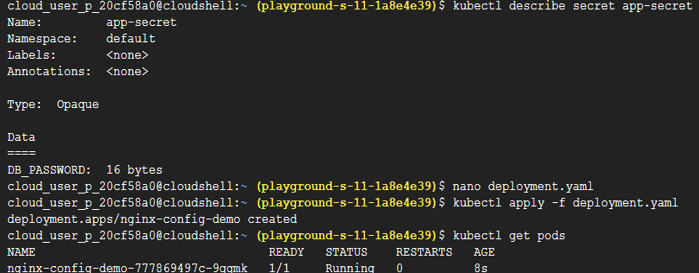
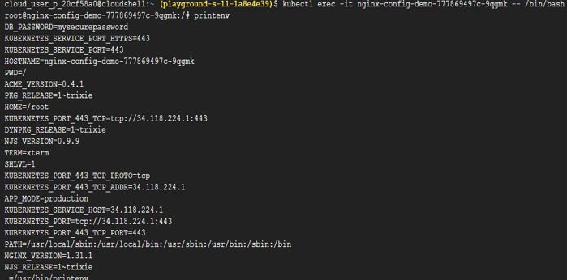
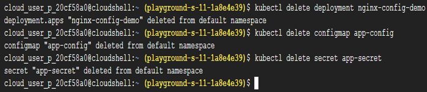

# Task 14 – Kubernetes ConfigMaps, Secrets & Environment Variables

## Objective

Learn how Kubernetes separates application configuration from application code by using ConfigMaps and Secrets, and inject configuration into containers through environment variables.

## Real-World Scenario

Enterprise applications often require runtime configuration such as:
- Database URLs
- API endpoints
- Feature flags
- Authentication tokens
- Passwords
- Environment-specific settings

Hardcoding these values inside application code makes deployments difficult, increases security risks, and reduces flexibility.
Kubernetes solves this problem by separating **application code** from **application configuration** using ConfigMaps and Secrets.

## Google Cloud Services Used

- Google Kubernetes Engine (GKE)
- Kubernetes ConfigMaps
- Kubernetes Secrets
- Cloud Shell
- kubectl

## Implementation Steps

### Step 1 – Create a Kubernetes Cluster

Navigate to: Kubernetes Engine | Create a new cluster using an **e2-small** machine configuration while leaving the remaining settings at their default values.

### Step 2 – Connect to the Cluster

Open **Cloud Shell** and connect `kubectl` to the cluster | gcloud container clusters get-credentials config-cluster --region REGION

Replace `REGION` with your selected region.

Verify the connection | kubectl get nodes

### Step 3 – Create a ConfigMap

Create a ConfigMap containing application configuration | kubectl create configmap app-config --from-literal=APP_MODE=production --from-literal=APP_COLOR=blue

Verify the ConfigMap | kubectl get configmaps

View its details | kubectl describe configmap app-config

### Step 4 – Create a Secret

Create a Kubernetes Secret for sensitive data | kubectl create secret generic app-secret --from-literal=DB_PASSWORD=mysecurepassword

Verify the Secret | kubectl get secrets

Inspect the Secret | kubectl describe secret app-secret

### Step 5 – Create the Deployment

Create the deployment manifest | nano deployment.yaml

Paste the following configuration.
```
apiVersion: apps/v1
kind: Deployment
metadata: 
    name: nginx-config-demo
spec: 
    replicas: 1
selector: 
    matchLabels: 
       app: nginx-config
template: 
    metadata: 
       labels: 
          app: nginx-config
spec: 
    containers: 
       name: nginx 
       image: nginx
env: 
    - name: APP_MODE 
      valueFrom: 
          configMapKeyRef: 
              name: app-config 
              key: APP_MODE
- name: DB_PASSWORD 
  valueFrom: 
      secretKeyRef: 
          name: app-secret 
          key: DB_PASSWORD
```

Save the file.

Deploy the application | kubectl apply -f deployment.yaml

Verify that the Pod is running | kubectl get pods

### Step 6 – Verify the Environment Variables

Access the running container | kubectl exec -it POD_NAME -- /bin/bash

Replace `POD_NAME` with the name of your running Pod.

Inside the container, display all environment variables | printenv

You should be able to observe values provided by both the ConfigMap and the Secret.

### Step 7 – Clean Up

Delete the Deployment | kubectl delete deployment nginx-config-demo

Delete the ConfigMap | kubectl delete configmap app-config

Delete the Secret | kubectl delete secret app-secret

Finally, delete the Kubernetes cluster from the Google Cloud Console.

## Key Concepts Learned

### ConfigMaps

A ConfigMap is a Kubernetes resource used to store **non-sensitive** application configuration. Typical examples include:
- Application mode
- API endpoints
- Feature flags
- Port numbers
- Application settings

ConfigMaps allow configuration to be updated independently of the application image.

### Secrets

A Secret is a Kubernetes resource designed to store **sensitive** information. Common examples include:
- Passwords
- API keys
- Authentication tokens
- Database credentials

Kubernetes stores Secret values in Base64-encoded form and provides mechanisms for securely injecting them into running containers.

### Externalized Configuration

Rather than embedding configuration directly inside application code, Kubernetes injects configuration at runtime.
This approach allows the same container image to be deployed across multiple environments while using different configuration values.

### Environment Variables

Applications should retrieve configuration through environment variables instead of hardcoded values. This enables:
- Environment-specific deployments
- Easier configuration changes
- Secret rotation
- Improved portability

Using environment variables is considered a cloud-native best practice.

### kubectl exec

The `kubectl exec` command allows administrators to execute commands inside a running container. It is commonly used for:
- Troubleshooting
- Debugging
- Inspecting application environments
- Running maintenance commands

### printenv

The `printenv` command displays all environment variables available inside the running container. This is useful for verifying that ConfigMaps and Secrets have been injected successfully.

### Runtime Configuration

During this lab, the container image remained unchanged while Kubernetes dynamically injected configuration values at runtime.
This separation between application code and configuration is a common pattern used in production Kubernetes environments.

### Common Commands

| Command | Purpose |
|---------|----------|
| `kubectl create configmap` | Create a ConfigMap |
| `kubectl create secret` | Create a Secret |
| `kubectl describe` | Display detailed resource information |
| `kubectl exec` | Execute commands inside a running container |
| `printenv` | Display environment variables |

## Outcome

Successfully created Kubernetes ConfigMaps and Secrets, injected configuration into a running container using environment variables, verified runtime configuration inside the Pod, and explored one of the most widely used configuration management patterns in production Kubernetes environments.

## Skills Practiced

- Kubernetes
- Google Kubernetes Engine (GKE)
- ConfigMaps
- Secrets
- Environment Variables
- kubectl
- Cloud-Native Configuration Management
- Container Administration

## Screenshots











