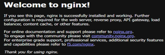
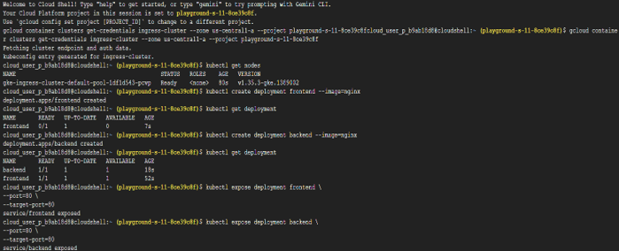
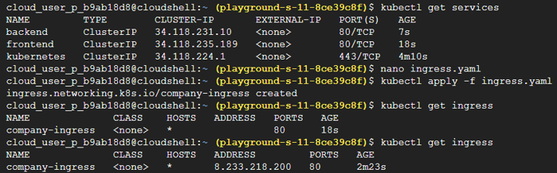

# Task 16 — Kubernetes Ingress + URL Routing + Single Entry Point

## Real-World Scenario

So far, applications have been exposed using **Service Type = LoadBalancer**, where each application receives its own public IP address. Example:
- Frontend → External IP #1
- Backend API → External IP #2
- Admin Portal → External IP #3

While this approach works, it becomes expensive and difficult to manage as the number of applications grows.

Imagine a company hosting multiple services:
- Frontend
- Backend API
- Admin Portal

Without Ingress:

34.12.1.10

34.12.1.11

34.12.1.12

Managing multiple public endpoints is inefficient.

Instead, production environments typically expose a **single public entry point**, allowing traffic to be routed based on the requested URL. 
Example:

company.com         → Frontend

company.com/api     → Backend

company.com/admin   → Admin Portal

This is exactly what **Kubernetes Ingress** provides.

# Solution

## Step 1 — Create a Kubernetes Cluster

- Open **Google Kubernetes Engine**.
- Create a new cluster using the **e2-small** machine configuration.
- Connect Cloud Shell to the cluster.

Verify the connection | kubectl get nodes

## Step 2 — Create the Frontend Deployment

kubectl create deployment frontend --image=nginx

## Step 3 — Create the Backend Deployment

kubectl create deployment backend --image=nginx

Verify both deployments | kubectl get deployments

## Step 4 — Expose the Frontend Service Internally

kubectl expose deployment frontend --port=80 --target-port=80

## Step 5 — Expose the Backend Service Internally

kubectl expose deployment backend --port=80 --target-port=80

Verify the services | kubectl get services

## Step 6 — Create the Ingress Resource

Create a new YAML file: nano ingress.yaml

Paste the following configuration:
```
apiVersion: networking.k8s.io/v1
kind: Ingress
metadata: 
    name: company-ingress
spec: 
    defaultBackend: 
        service: 
            name: frontend 
            port: 
               number: 80
```

Save the file:

## Step 7 — Apply the Ingress Configuration

kubectl apply -f ingress.yaml

## Step 8 — Verify the Ingress

kubectl get ingress | Once an external address appears, the Ingress has been created successfully. At this point, Kubernetes has created a single entry point for your application.

# Concepts

## ClusterIP

**ClusterIP** is the default Kubernetes Service type.
It allows communication **only inside the Kubernetes cluster** and does not expose a public IP address.
This service type is commonly used for communication between backend services, APIs, and databases.

## Kubernetes Ingress

An **Ingress** is a Kubernetes API object that manages external HTTP and HTTPS access to services running inside a cluster.
Instead of exposing every application individually, Ingress provides a **single public endpoint** and routes incoming requests to the appropriate service based on hostnames or URL paths.

Example:

company.com         → Frontend

company.com/api     → Backend

company.com/admin   → Admin Portal

## What Happens Internally?

When an Ingress resource is created in Google Kubernetes Engine (GKE), Kubernetes automatically provisions the required cloud networking resources, including:
- External Load Balancer
- Backend Services
- Health Checks
- Forwarding Rules

These components work together to distribute incoming traffic to the appropriate Kubernetes Service.

## Reverse Proxy

Ingress functions as a **reverse proxy**.
Instead of users connecting directly to individual Pods or Services, requests first reach the Ingress controller, which determines the correct destination based on the routing rules.

Traffic flow: User -> Ingress ├────────► Frontend Service ────────► Backend Service

This architecture provides a single, stable entry point while keeping internal services isolated from direct external access.

## Why Ingress Matters

Using Ingress provides several production benefits:
- Single public endpoint for multiple applications
- URL-based and host-based routing
- Reduced infrastructure cost compared to multiple LoadBalancers
- Centralized traffic management
- Easier SSL/TLS configuration
- Better scalability for cloud-native applications

Ingress is the standard approach for exposing multiple services in Kubernetes-based production environments.

## Screenshots








