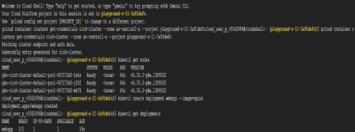
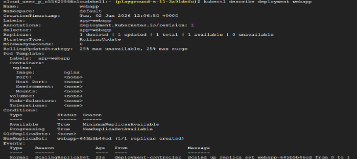
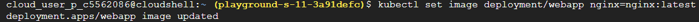
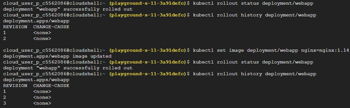
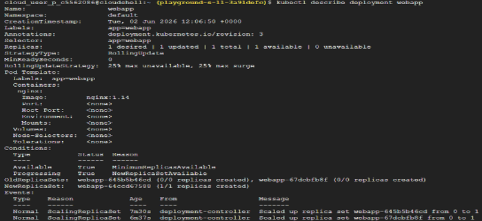
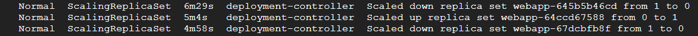

# Task 17 – CI/CD for Kubernetes (From Scratch)

## Objective

Understand how Kubernetes deployments are updated in real-world CI/CD pipelines, learn how rolling updates work, monitor deployment progress, and explore deployment revision history.

## Real-World Scenario

So far, deployments have been performed manually using commands such as: kubectl apply -f deployment.yaml
While this approach is useful for learning, real companies automate deployments through Continuous Integration and Continuous Deployment (CI/CD) pipelines.
A typical deployment workflow looks like this:
Developer Pushes Code -> Git Repository -> CI/CD Pipeline -> Build Container Image -> Deploy to Kubernetes
Instead of manually building images, updating deployments, and applying configuration changes, the pipeline performs these tasks automatically.

Imagine updating your application from **"Welcome to Version 1"** to **"Welcome to Version 2"**. Rather than manually deploying the new version, the CI/CD pipeline automatically updates the Kubernetes Deployment.

## Google Cloud Services Used

- Google Kubernetes Engine (GKE)
- Kubernetes Deployments
- Cloud Shell
- kubectl

## Implementation Steps

### Step 1 – Create a Kubernetes Cluster

Navigate to: Kubernetes Engine
Create a new cluster using the **e2-small** machine configuration.
Connect Cloud Shell to the cluster and verify the connection.
kubectl get nodes

### Step 2 – Deploy the Initial Application

Create a Deployment using the official Nginx image.
kubectl create deployment webapp --image=nginx
Verify that the Deployment has been created.
kubectl get deployments
View detailed information about the Deployment.
kubectl describe deployment webapp

### Step 3 – Simulate a CI/CD Deployment

Simulate an automated deployment by updating the container image.
kubectl set image deployment/webapp nginx=nginx:latest
This represents a CI/CD pipeline deploying a new application version.

### Step 4 – Monitor the Rollout

Check whether the Deployment update completes successfully.
kubectl rollout status deployment/webapp

### Step 5 – View Deployment History

Display the rollout history.
kubectl rollout history deployment/webapp
Each successful deployment creates a new revision that Kubernetes records automatically.

### Step 6 – Simulate Another Release

Update the Deployment again using a different image version.
kubectl set image deployment/webapp nginx=nginx:1.14
Monitor the rollout.
kubectl rollout status deployment/webapp
View the updated rollout history.
kubectl rollout history deployment/webapp

## Key Concepts Learned

### Continuous Integration (CI)

Continuous Integration is the practice of frequently merging code changes into a shared repository where automated systems validate and prepare the application for deployment.

### Continuous Deployment (CD)

Continuous Deployment automates the release process by deploying validated application changes to Kubernetes with minimal manual intervention.

### CI/CD Pipeline

A CI/CD pipeline automates the software delivery process. Typical workflow: Developer → Git Repository → Build → Test → Deploy → Kubernetes
Automation improves deployment consistency, reduces manual effort, and minimizes human error.

### Kubernetes Rolling Updates

Kubernetes updates applications using a **Rolling Update** strategy instead of stopping every Pod at once.
The update process follows this sequence: Old Pod -> New Pod Created -> Traffic Shifted -> Old Pod Removed
This strategy allows applications to remain available during deployments with little or no downtime.

### Rollout Status

The command: kubectl rollout status deployment/webapp
monitors the progress of a Deployment update and confirms whether the rollout completed successfully.

### Rollout History

Kubernetes maintains a revision history for every Deployment.
You can view previous revisions using: kubectl rollout history deployment/webapp
If a deployment introduces an issue, administrators can roll back to a previous working revision without rebuilding the application.

### Why CI/CD Matters

Automated deployment pipelines provide several benefits:
- Faster application releases
- Consistent deployment process
- Reduced human error
- Easier version tracking
- Safer production deployments
- Support for rolling updates and rollbacks

## Outcome

Successfully simulated a Kubernetes CI/CD deployment by updating a Deployment, monitoring rollout progress, viewing deployment history, and understanding how Kubernetes performs rolling updates with minimal downtime.

## Skills Practiced

- Kubernetes
- Google Kubernetes Engine (GKE)
- CI/CD Concepts
- Kubernetes Deployments
- Rolling Updates
- Rollout History
- kubectl

## Screenshots

