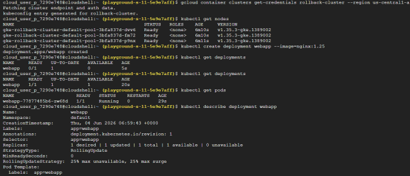
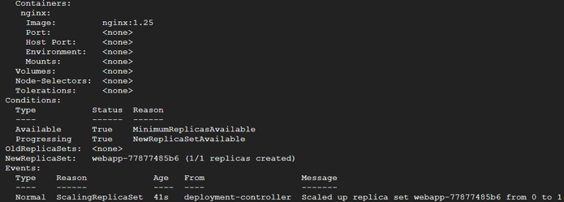
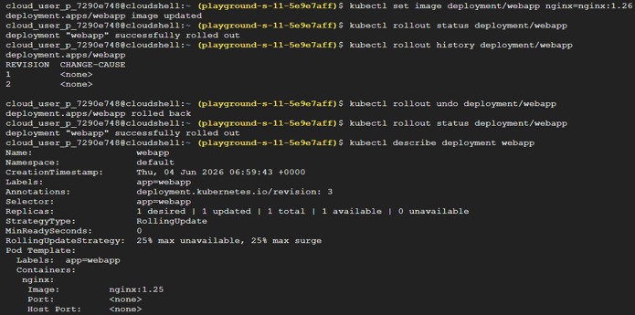
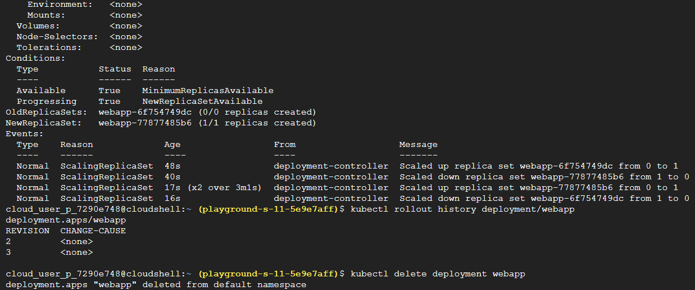

# Task 18 – Kubernetes Rolling Updates & Rollbacks

## Objective

Learn how Kubernetes performs rolling updates with minimal downtime and how to safely roll back an application deployment when a new release introduces issues.

## Real-World Scenario

Software deployments do not always go as planned. A new version may introduce bugs, break application functionality, or impact production users.
For example:
- Version 1 of an e-commerce application works correctly.
- Version 2 is deployed.
- Users suddenly cannot log in or complete purchases.
Rather than rebuilding the application from scratch, Kubernetes allows engineers to quickly roll back to a previous stable version.
This capability is essential for maintaining application availability and minimizing downtime.

## Google Cloud Services Used

- Google Kubernetes Engine (GKE)
- Kubernetes Deployments
- Cloud Shell
- kubectl

## Implementation Steps

### Step 1 – Create a Kubernetes Cluster

Navigate to: Kubernetes Engine
Create a new cluster using an **e2-small** machine configuration.

### Step 2 – Connect to the Cluster

Open **Cloud Shell** and connect `kubectl` to the cluster.
Verify the connection.
kubectl get nodes

### Step 3 – Deploy Version 1 of the Application

Create the initial deployment.
kubectl create deployment webapp --image=nginx:1.25
Verify that the deployment has been created.
kubectl get deployments
Check the running Pods.
kubectl get pods
View the deployment configuration, including the currently deployed image.
kubectl describe deployment webapp

### Step 4 – Perform a Rolling Update

Deploy a newer version of the application.
kubectl set image deployment/webapp nginx=nginx:1.26
Monitor the rollout process.
kubectl rollout status deployment/webapp
View the deployment revision history.
kubectl rollout history deployment/webapp
Kubernetes performs the update gradually by replacing old Pods with new ones while keeping the application available.

### Step 5 – Roll Back the Deployment

Simulate a failed release by rolling back to the previous version.
kubectl rollout undo deployment/webapp
Verify that the rollback completed successfully.
kubectl rollout status deployment/webapp
Inspect the deployment again.
kubectl describe deployment webapp
View the deployment revision history.
kubectl rollout history deployment/webapp
The application should now be running the previous stable version.

## Key Concepts Learned

### Rolling Updates

A Rolling Update replaces application instances gradually instead of shutting everything down at once. The update process typically follows this sequence:
Old Pod -> New Pod Created -> Traffic Shifted -> Old Pod Removed
This strategy minimizes downtime and allows users to continue accessing the application during deployments.

### Deployment Revisions

Every time a Deployment's Pod template changes (such as updating the container image), Kubernetes creates a new revision. For example:
- Revision 1 → Initial deployment
- Revision 2 → Updated application
- Revision 3 → Another release
Deployment revisions act like restore points, allowing previous versions to be recovered if necessary.

### Rollbacks

A rollback restores a Deployment to a previously working revision. This is useful when a new application version introduces unexpected issues.
Instead of rebuilding or manually recreating the Deployment, Kubernetes automatically restores the previous stable configuration.

### Deployment History

Kubernetes maintains a history of Deployment revisions. This history allows engineers to:
- Review previous releases
- Identify deployment changes
- Roll back failed updates
- Recover stable application versions quickly
Revision numbers continue increasing over time, providing a complete deployment history.

## Outcome

Successfully explored Kubernetes rolling updates and deployment rollbacks by deploying multiple application versions, monitoring rollout progress, viewing deployment history, and restoring a previous stable release using Kubernetes' built-in rollback mechanism.

## Skills Practiced

- Kubernetes
- Google Kubernetes Engine (GKE)
- Deployments
- Rolling Updates
- Rollbacks
- Deployment Revisions
- Release Management
- kubectl

## Screenshots

