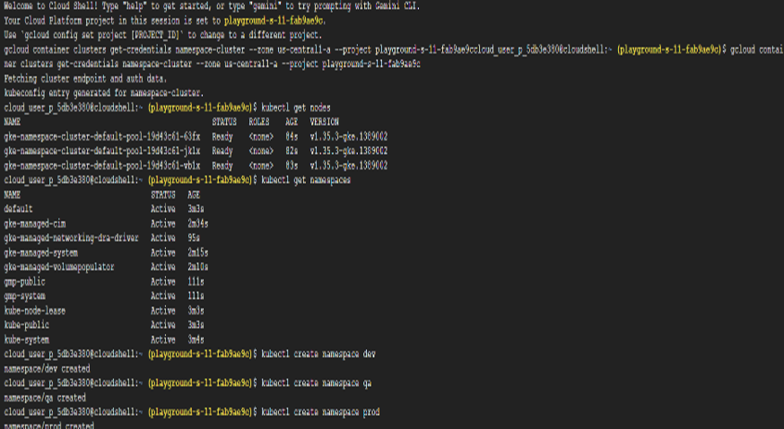
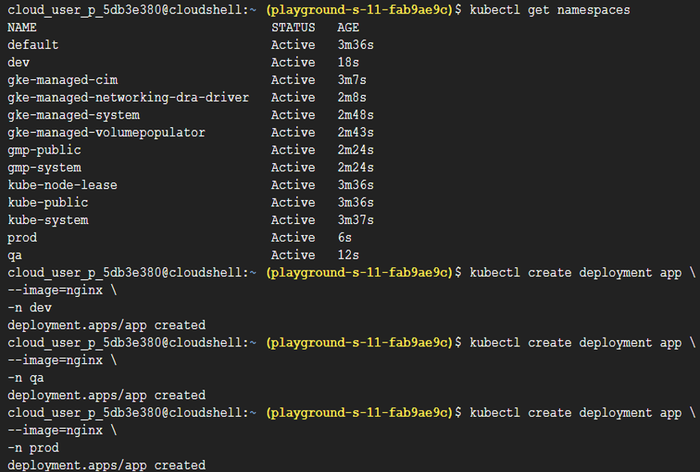
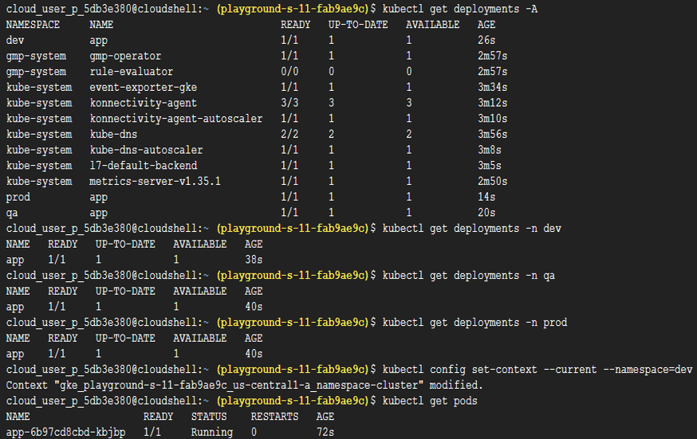
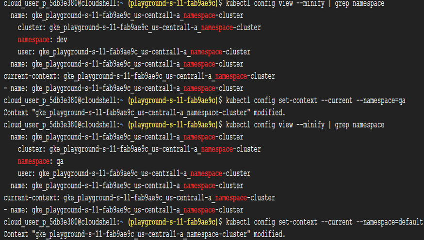

# Task 19 – Kubernetes Namespaces & Multi-Team Environments

## Objective

Learn how Kubernetes Namespaces provide logical isolation within a cluster, allowing multiple teams, applications, and environments to share the same Kubernetes cluster without resource naming conflicts.

## Real-World Scenario

Large organizations often have multiple teams working within a single Kubernetes cluster. For example:
- Frontend Team
- Backend Team
- Data Team
If every team deploys an application named `app`, Kubernetes would normally encounter naming conflicts. Namespaces solve this problem by isolating resources.
For example:
- `dev/app`
- `qa/app`
- `prod/app`
Although the Deployment name is the same, each exists independently within its own Namespace.

## Google Cloud Services Used

- Google Kubernetes Engine (GKE)
- Kubernetes Namespaces
- Cloud Shell
- kubectl

## Implementation Steps

### Step 1 – Create a Kubernetes Cluster

Navigate to: Kubernetes Engine
Create a new cluster using an **e2-small** machine configuration.

### Step 2 – Connect to the Cluster

Open **Cloud Shell** and connect `kubectl` to the cluster.
Verify the connection.
kubectl get nodes

### Step 3 – View Existing Namespaces

Display the namespaces already present in the cluster.
kubectl get namespaces

### Step 4 – Create Separate Namespaces

Create namespaces for different environments.
kubectl create namespace dev
kubectl create namespace qa
kubectl create namespace prod
Verify that all namespaces have been created.
kubectl get namespaces

### Step 5 – Deploy Applications into Each Namespace

Deploy the same application into the **Development** namespace.
kubectl create deployment app --image=nginx -n dev
Deploy the application into the **QA** namespace.
kubectl create deployment app --image=nginx -n qa
Deploy the application into the **Production** namespace.
kubectl create deployment app --image=nginx -n prod
Although every Deployment is named **app**, they exist independently because each belongs to a different Namespace.

### Step 6 – View Deployments

View Deployments across all namespaces.
kubectl get deployments -A
View Deployments only in the Development namespace.
kubectl get deployments -n dev
View Deployments only in the QA namespace.
kubectl get deployments -n qa
View Deployments only in the Production namespace.
kubectl get deployments -n prod

### Step 7 – Set the Default Namespace

Configure the current context to use the Development namespace.
kubectl config set-context --current --namespace=dev
Verify the current resources.
kubectl get pods
Check the active namespace.
kubectl config view --minify | grep namespace

### Step 8 – Switch Between Namespaces

Switch the active namespace to QA.
kubectl config set-context --current --namespace=qa
Verify the change.
kubectl config view --minify | grep namespace
Return to the default namespace.
kubectl config set-context --current --namespace=default

### Step 9 – Clean Up Resources

Delete the namespaces.
kubectl delete namespace dev
kubectl delete namespace qa
kubectl delete namespace prod
Finally, delete the Kubernetes cluster from the Google Cloud Console.

## Key Concepts Learned

### Kubernetes Namespaces

Namespaces provide logical isolation within a Kubernetes cluster. They allow multiple teams, projects, or environments to share the same cluster while keeping resources separated.

### Default Namespaces

Every Kubernetes cluster contains several built-in namespaces. Common namespaces include:

| Namespace | Purpose |
|-----------|---------|
| `default` | Default location for user-created resources |
| `kube-system` | Kubernetes system components such as DNS, controllers, and Metrics Server |
| `kube-public` | Publicly readable cluster resources |
| `kube-node-lease` | Stores node heartbeat information |

### Resource Isolation

Namespaces allow resources with identical names to coexist. For example:
dev/app
qa/app
prod/app
Each Deployment is unique because it belongs to a different Namespace.

### Environment Separation

Namespaces are commonly used to separate environments such as:
- Development
- Quality Assurance (QA)
- Production
This enables teams to work independently while sharing the same Kubernetes infrastructure.

### Namespace Context

The active namespace determines where `kubectl` commands are executed by default. Changing the current namespace eliminates the need to specify the `-n` flag with every command.

### Real-World Analogy

Namespaces work like folders on a computer.
Each folder can contain files with the same name because they are stored separately.
Kubernetes Namespaces follow the same concept by organizing cluster resources into isolated logical groups.

## Outcome

Successfully explored Kubernetes Namespaces by creating isolated environments, deploying identical applications without naming conflicts, switching between namespaces using the Kubernetes context, and understanding how enterprise teams organize workloads within a shared cluster.

## Skills Practiced

- Kubernetes
- Google Kubernetes Engine (GKE)
- Namespaces
- Multi-Environment Deployments
- Resource Isolation
- kubectl
- Cluster Organization

## Screenshots

