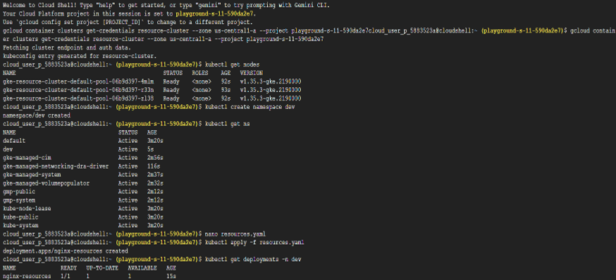
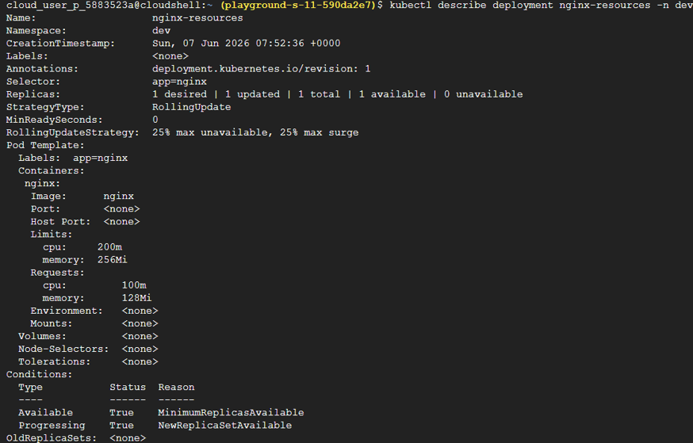
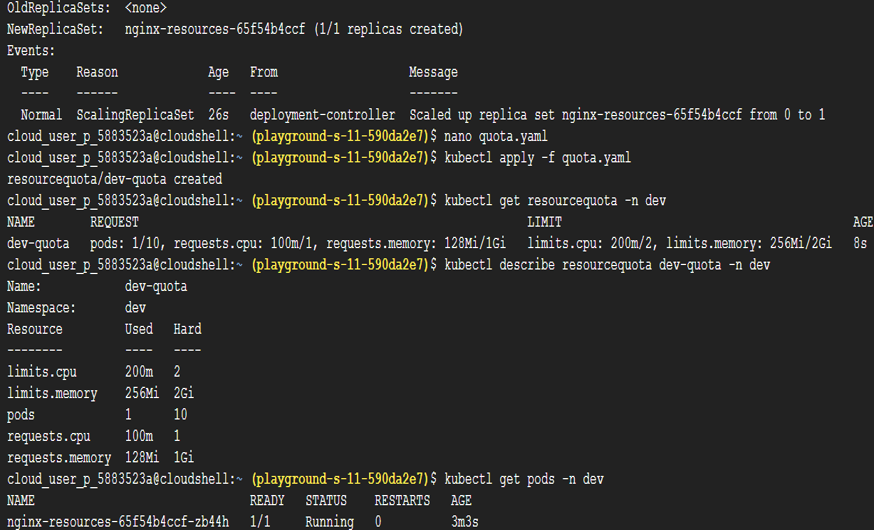
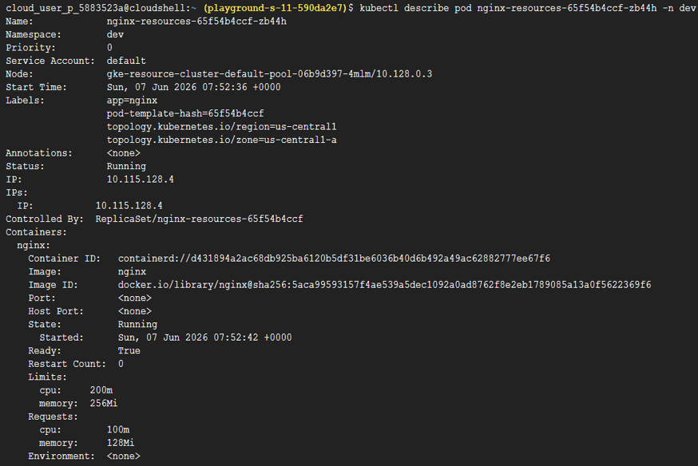
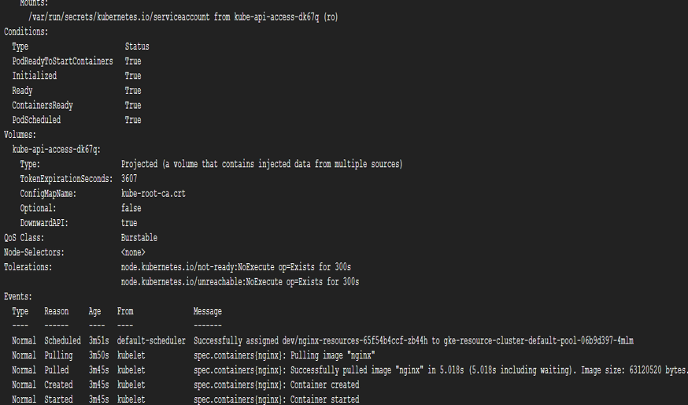

# Task 20 – Kubernetes Resource Requests, Limits & Quotas

## Objective

Learn how Kubernetes manages CPU and memory resources using **Requests**, **Limits**, and **ResourceQuotas** to ensure fair resource allocation and prevent workloads from consuming excessive cluster resources.

## Real-World Scenario

In a shared Kubernetes cluster, multiple teams and applications compete for the same compute resources. Without resource management, a single application could consume excessive CPU or memory, negatively affecting other workloads running in the cluster.
Kubernetes addresses this by allowing engineers to define:
- **Requests** – Minimum resources guaranteed for a Pod
- **Limits** – Maximum resources a Pod can consume
- **ResourceQuotas** – Namespace-wide resource limits for teams or environments
These controls help maintain cluster stability and efficient resource utilization.

## Google Cloud Services Used

- Google Kubernetes Engine (GKE)
- Kubernetes Deployments
- Resource Requests
- Resource Limits
- ResourceQuotas
- Cloud Shell
- kubectl

## Implementation Steps

### Step 1 – Create a Kubernetes Cluster

Navigate to: Kubernetes Engine
Create a new cluster using an **e2-small** machine configuration.

### Step 2 – Connect to the Cluster

Open **Cloud Shell** and connect `kubectl` to the cluster. Verify the connection.
kubectl get nodes

### Step 3 – Create a Namespace

Create a namespace for the deployment.
kubectl create namespace dev
Verify that the namespace has been created.
kubectl get ns

### Step 4 – Create a Resource-Limited Deployment

Create a deployment manifest.
nano resources.yaml
Paste the following configuration.

apiVersion: apps/v1
kind: Deployment
metadata:
    name: nginx-resources
    namespace: dev
spec: 
    replicas: 1
selector: 
    matchLabels: 
        app: nginx
template: 
    metadata: 
       labels: 
          app: nginx
spec: 
    containers: 
       - name: nginx 
         image: nginx
resources: 
    requests: 
         cpu: "100m" 
         memory: "128Mi"
limits: 
    cpu: "200m" 
    memory: "256Mi"
Save the file.

Deploy the application.
kubectl apply -f resources.yaml
Verify the deployment.
kubectl get deployments -n dev
Inspect the configured resource requests and limits.
kubectl describe deployment nginx-resources -n dev

### Step 5 – Create a ResourceQuota

Create a ResourceQuota manifest.
nano quota.yaml

Paste the following configuration.

apiVersion: v1
kind: ResourceQuota
metadata: name: dev-quota namespace: dev
spec: hard: requests.cpu: "1" requests.memory: 1Gi
limits.cpu: "2" limits.memory: 2Gi pods: "10"
Save the file.

Apply the ResourceQuota.
kubectl apply -f quota.yaml
Verify that the quota has been created.
kubectl get resourcequota -n dev
View detailed quota information.
kubectl describe resourcequota dev-quota -n dev

Observe the current resource usage and remaining capacity within the namespace.

### Step 6 – Inspect the Running Pod

View the running Pod.
kubectl get pods -n dev
Inspect the Pod configuration.
kubectl describe pod <pod-name> -n dev
Replace `<pod-name>` with the name of your running Pod.

## Key Concepts Learned

### Resource Requests

Resource Requests define the minimum CPU and memory that Kubernetes guarantees to a Pod. The scheduler uses these values when deciding which node has sufficient capacity to run the workload.

### Resource Limits

Resource Limits define the maximum amount of CPU and memory that a Pod is allowed to consume. If an application exceeds its configured limits, Kubernetes may throttle CPU usage or terminate the container if memory usage becomes excessive.

### ResourceQuota

A ResourceQuota limits the total amount of resources that can be consumed within a Namespace. It helps organizations allocate cluster resources fairly across multiple teams and environments. Common quota limits include:
- CPU
- Memory
- Number of Pods
- Storage
- Persistent Volume Claims

### CPU Units

Kubernetes measures CPU in **milliCPU (m)**. Examples:

| Value | Meaning |
|--------|---------|
| `1000m` | 1 CPU Core |
| `500m` | 0.5 CPU Core |
| `250m` | 0.25 CPU Core |
| `100m` | 0.1 CPU Core |

### Memory Units

Memory is commonly specified using **Mi (Mebibytes)**. For example: 128Mi
represents approximately **128 MB** of memory.

### Resource Consumption

When viewing the ResourceQuota, Kubernetes displays both current usage and maximum allowed resources. For example:
Used CPU: 100mHard CPU: 1

This indicates:
- Approximately **10%** of the available CPU request quota has been consumed.
- Approximately **90%** remains available for additional workloads.

## Outcome

Successfully explored Kubernetes resource management by configuring CPU and memory requests and limits for a Deployment, applying namespace-level ResourceQuotas, and observing how Kubernetes allocates and enforces resource usage within a shared cluster.

## Skills Practiced

- Kubernetes
- Google Kubernetes Engine (GKE)
- Resource Requests
- Resource Limits
- ResourceQuotas
- Namespace Management
- Resource Allocation
- kubectl

## Screenshots

