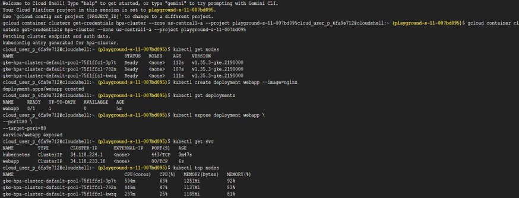
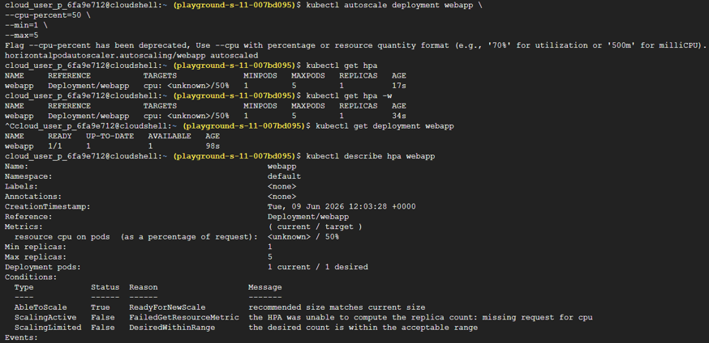
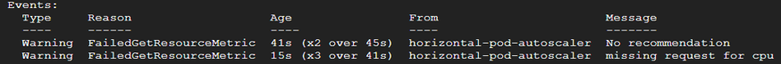

# Task 21 – Horizontal Pod Autoscaler (HPA)

## Objective

Learn how Kubernetes automatically scales applications using the **Horizontal Pod Autoscaler (HPA)\* based on resource utilization, eliminating the need for manual scaling as application demand changes.

## Real-World Scenario

As application traffic grows, manually increasing the number of Pods is neither practical nor efficient. For example, instead of repeatedly running:
kubectl scale deployment webapp --replicas=4
production environments rely on Kubernetes to scale applications automatically.
The typical workflow is:
Traffic Increases -> CPU Usage Rises -> HPA Detects Higher Utilization -> Additional Pods Created Automatically
This allows applications to respond dynamically to changing workloads while maintaining performance.

## Google Cloud Services Used

- Google Kubernetes Engine (GKE)
- Horizontal Pod Autoscaler (HPA)
- Metrics Server
- Cloud Shell
- kubectl

## Implementation Steps

### Step 1 – Create a Kubernetes Cluster

Navigate to: Kubernetes Engine
Create a new cluster using an **e2-small** machine configuration.

### Step 2 – Connect to the Cluster

Open **Cloud Shell** and connect `kubectl` to the cluster. Verify the connection.
kubectl get nodes

### Step 3 – Deploy the Application

Create a Deployment.
kubectl create deployment webapp --image=nginx
Verify the Deployment.
kubectl get deployments

### Step 4 – Expose the Deployment

Expose the application as a Service.
kubectl expose deployment webapp --port=80 --target-port=80
Verify the Service.
kubectl get svc

### Step 5 – Verify the Metrics Server

Check whether the Metrics Server is available.
kubectl top nodes
The Metrics Server provides the CPU and memory metrics required by the Horizontal Pod Autoscaler.

### Step 6 – Create the Horizontal Pod Autoscaler

Create an HPA for the Deployment.
kubectl autoscale deployment webapp --cpu-percent=50 --min=1 --max=5
Verify that the HPA has been created.
kubectl get hpa
Watch the autoscaler in real time.
kubectl get hpa -w

### Step 7 – Inspect the Autoscaler

View the Deployment.
kubectl get deployment webapp
Inspect the HPA configuration and status.
kubectl describe hpa webapp

## Sandbox Observation

> The **Horizontal Pod Autoscaler (HPA)** was successfully created, but automatic scaling did not occur because the Deployment did not define **CPU resource requests**.
> HPA calculates utilization as a percentage of the requested CPU resources. Without CPU requests, Kubernetes cannot determine utilization metrics, resulting in the following error:
FailedGetResourceMetric: missing request for cpu
This demonstrated an important production dependency between \*\*Resource Requests\*\* and the \*\*Horizontal Pod Autoscaler\*\*.

**Lab Status**
- ✅ HPA Created Successfully
- ✅ Metrics Server Verified
- ✅ HPA Controller Operational
- ✅ Scaling Dependency Understood
- ⚠️ Automatic Scaling Not Triggered Due to Missing CPU Requests

## Key Concepts Learned

### Horizontal Pod Autoscaler (HPA)

The Horizontal Pod Autoscaler automatically adjusts the number of Pod replicas based on observed resource utilization, most commonly CPU usage.
This enables Kubernetes applications to scale automatically without manual intervention.

### Automatic Scaling Workflow

The HPA continuously monitors application resource usage. A typical scaling workflow is:
Traffic Increases -> CPU Utilization Rises -> Metrics Server Reports Usage -> HPA Evaluates Target Threshold -> Deployment Replica Count Adjusted

### Autoscaler Configuration

The autoscaler was created using: kubectl autoscale deployment webapp --cpu-percent=50 --min=1 --max=5
Configuration summary:
- Target CPU Utilization: **50%**
- Minimum Pods: **1**
- Maximum Pods: **5**
If CPU utilization exceeds the configured threshold, Kubernetes creates additional Pods until the maximum replica count is reached.

### Metrics Server

The Metrics Server collects CPU and memory usage information from cluster nodes and Pods.
The Horizontal Pod Autoscaler depends on these metrics to determine when scaling actions should occur.

### CPU Resource Requests

HPA calculates CPU utilization as a percentage of the CPU requested by each Pod.
If a Deployment does not define CPU requests, Kubernetes cannot calculate utilization percentages, preventing automatic scaling.
This highlights the importance of properly configuring resource requests when implementing autoscaling.

## Outcome

Successfully explored Kubernetes Horizontal Pod Autoscaling by creating an HPA, verifying Metrics Server functionality, understanding how Kubernetes performs automatic scaling, and identifying the dependency between CPU resource requests and autoscaling behavior within a Kubernetes cluster.

## Skills Practiced

- Kubernetes
- Google Kubernetes Engine (GKE)
- Horizontal Pod Autoscaler (HPA)
- Metrics Server
- Automatic Scaling
- Resource Requests
- kubectl

## Screenshots

