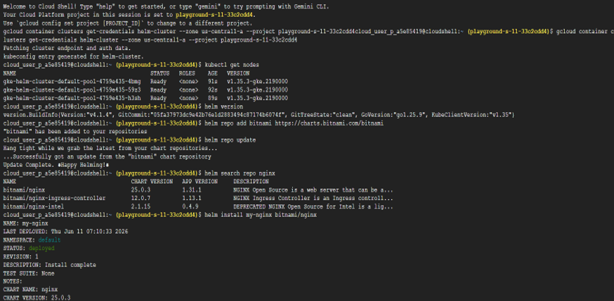
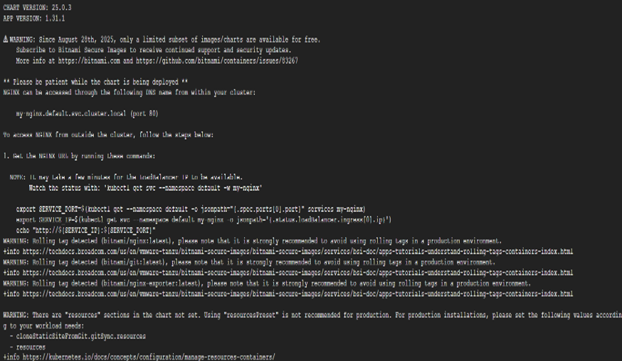
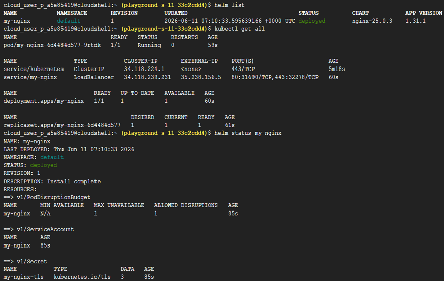
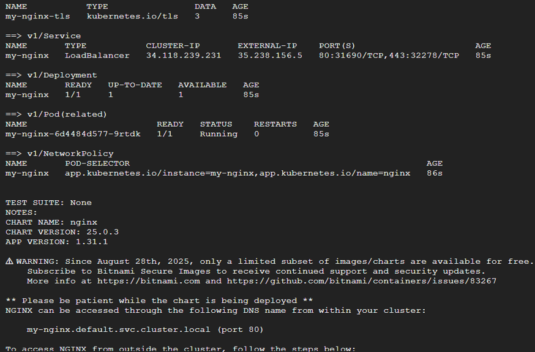
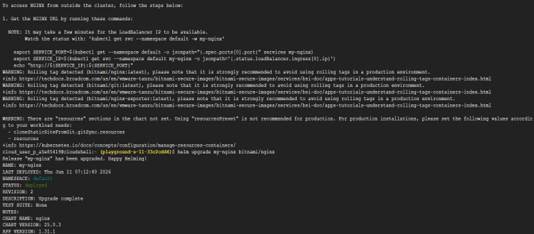
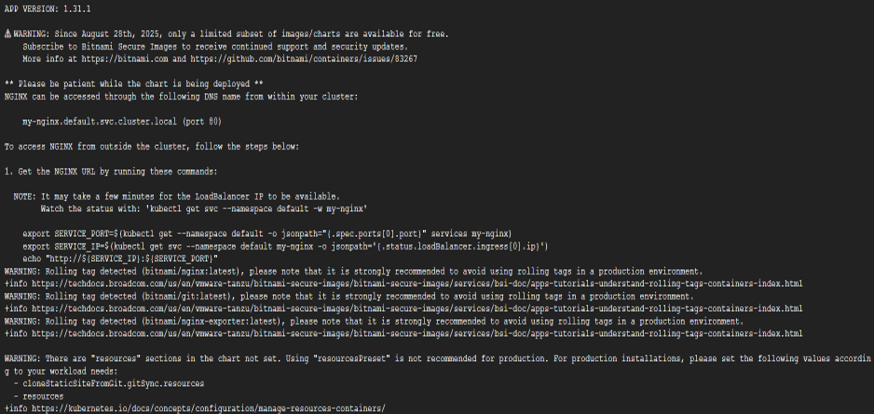
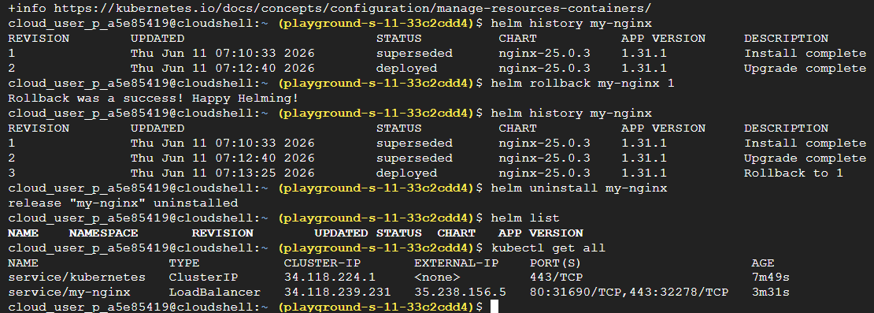

# Task 22 – Helm: The Kubernetes Package Manager

## Objective

Learn how to use **Helm**, the package manager for Kubernetes, to deploy, manage, upgrade, roll back, and uninstall applications using reusable Helm Charts instead of manually creating multiple Kubernetes YAML files.

## Real-World Scenario

Deploying complex Kubernetes applications manually often requires numerous YAML configuration files. For example:
- NGINX → Multiple Kubernetes resources
- Prometheus → Several YAML manifests
- Enterprise applications → Hundreds of YAML files
Managing these resources manually becomes difficult and error-prone.
Helm simplifies this process by packaging Kubernetes resources into reusable **Charts**, allowing entire applications to be installed with a single command.

Much like:
- `apt` for Ubuntu
- `pip` for Python
- `npm` for Node.js
Helm serves as the package manager for Kubernetes.

## Google Cloud Services Used

- Google Kubernetes Engine (GKE)
- Helm
- Helm Repository
- Helm Charts
- Cloud Shell
- kubectl

## Implementation Steps

### Step 1 – Create a Kubernetes Cluster

Navigate to: Kubernetes Engine
Create a new cluster using an **e2-small** machine configuration.

### Step 2 – Connect to the Cluster

Open **Cloud Shell** and connect `kubectl` to the cluster.
Verify the connection.
kubectl get nodes

### Step 3 – Verify Helm Installation

Check whether Helm is installed.
helm version

### Step 4 – Add a Helm Repository

Add the Bitnami Helm repository.
helm repo add bitnami https://charts.bitnami.com/bitnami
Update the local repository index.
helm repo update

### Step 5 – Search Available Charts

Search the repository for available NGINX charts.
helm search repo nginx

### Step 6 – Install an Application Using Helm

Install the Bitnami NGINX Chart.
helm install my-nginx bitnami/nginx
Verify the installed release.
helm list
Verify the Kubernetes resources created by Helm.
kubectl get all
Observe that Helm automatically creates the required Kubernetes objects without manually writing YAML manifests.

### Step 7 – Manage the Helm Release

View detailed information about the installed release.
helm status my-nginx
Upgrade the release.
helm upgrade my-nginx bitnami/nginx
View the release history.
helm history my-nginx

### Step 8 – Roll Back the Release

Roll back the application to Revision 1.
helm rollback my-nginx 1
Verify the revision history.
helm history my-nginx

### Step 9 – Uninstall the Application

Remove the Helm release.
helm uninstall my-nginx
Verify that the release has been removed.
helm list
Verify that the Kubernetes resources have also been deleted.
kubectl get all

## Key Concepts Learned

### Helm

Helm is the package manager for Kubernetes.
It packages Kubernetes resources into reusable **Charts**, allowing applications to be installed, upgraded, rolled back, and removed using simple commands instead of manually managing numerous YAML files.

### Helm Charts

A **Chart** is a packaged collection of Kubernetes resource definitions required to deploy an application. Examples include:
- NGINX
- Prometheus
- Grafana
- PostgreSQL
- Redis
Charts make deployments reusable, consistent, and easy to share.

### Helm Releases

A **Release** is an installed instance of a Helm Chart. For example:
- `nginx-prod`
- `nginx-dev`
Both releases can originate from the same Chart while maintaining separate configurations.

### Helm Repositories

A Helm Repository stores collections of Charts, similar to how Docker Hub stores container images. Comparison:

| Platform | Stores |
|----------|--------|
| Docker Hub | Container Images |
| Helm Repository | Helm Charts |

### Automated Resource Creation

When the following command is executed:
helm install my-nginx bitnami/nginx
Helm automatically creates all required Kubernetes resources, such as:
- Deployments
- Services
- Pods
- Labels
- Selectors
without requiring manual YAML configuration.

### Release Management

Helm provides built-in lifecycle management for Kubernetes applications. Common operations include:
- Install
- Upgrade
- Rollback
- Uninstall
- View Release History
This simplifies application maintenance throughout the deployment lifecycle.

## Outcome

Successfully explored Helm by adding a Helm repository, searching for application Charts, deploying an NGINX application, inspecting release information, performing upgrades and rollbacks, and managing the complete application lifecycle using Helm within a Kubernetes cluster.

## Skills Practiced

- Kubernetes
- Google Kubernetes Engine (GKE)
- Helm
- Helm Charts
- Helm Repositories
- Release Management
- Application Deployment
- kubectl

## Screenshots

