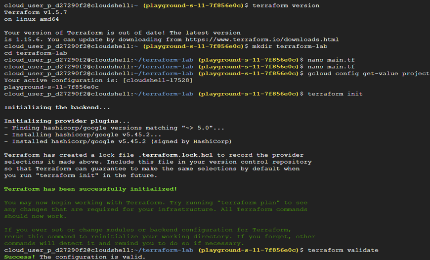
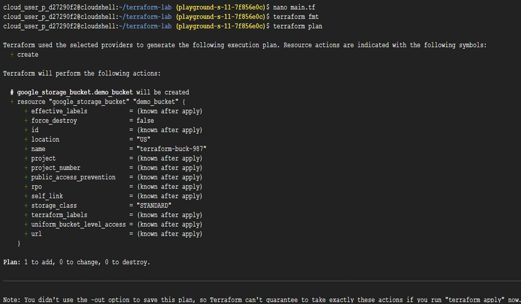
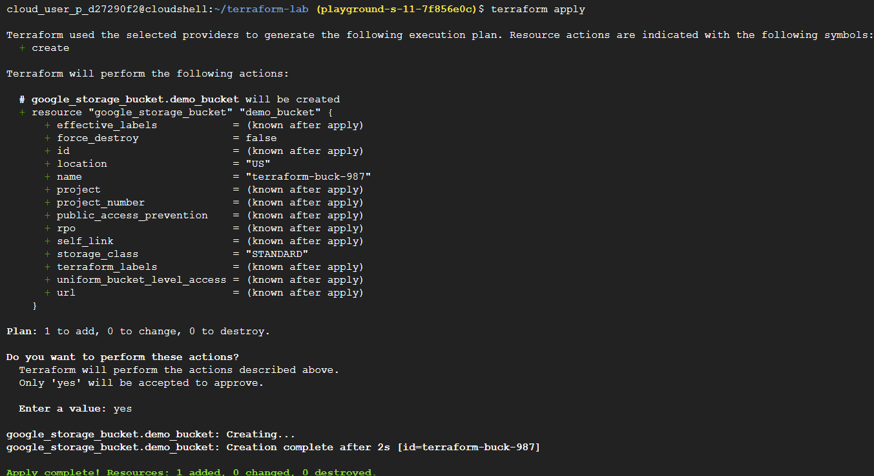
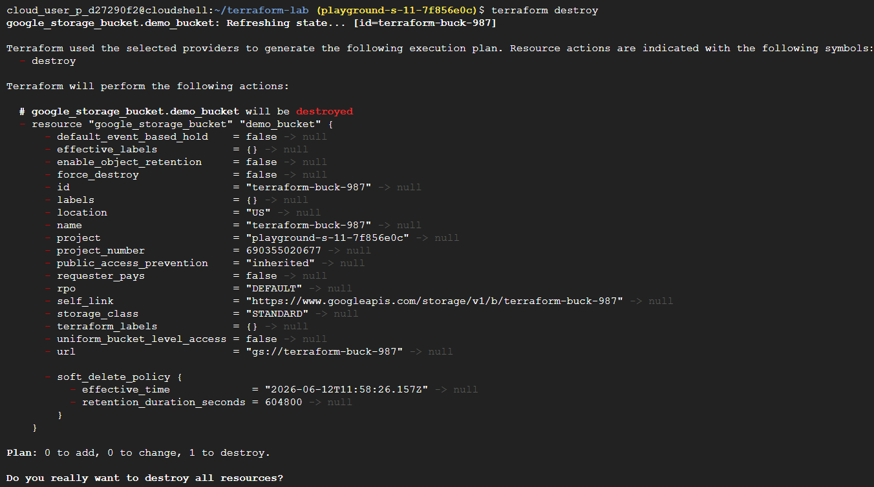
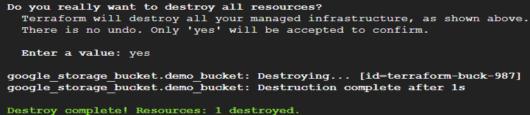

# Task 23 – Terraform Fundamentals & Infrastructure as Code (IaC)

## Objective

Learn the fundamentals of **Terraform** and understand how Infrastructure as Code (IaC) enables cloud resources to be provisioned, managed, and version-controlled using configuration files instead of manual console operations.

## Real-World Scenario

If Kubernetes manages applications, Terraform manages the infrastructure those applications run on. Instead of manually creating cloud resources through the Google Cloud Console, engineers define infrastructure in code. This approach enables infrastructure to be:
- Automated
- Repeatable
- Version-controlled
- Consistent across environments

Infrastructure as Code is a core practice in modern Cloud and DevOps engineering.

## Google Cloud Services Used

- Google Cloud Storage
- Terraform
- Google Cloud Provider
- Cloud Shell

## Implementation Steps

### Step 1 – Verify Terraform Installation

Open **Cloud Shell**. Verify that Terraform is available | terraform version

Create a working directory.

mkdir terraform-lab
cd terraform-lab

### Step 2 – Create the Terraform Configuration

Create a Terraform configuration file | nano main.tf

Paste the following configuration.

Replace `YOUR_PROJECT_ID` with your own Google Cloud Project ID.
```
terraform {
    required_providers {
	google = {
	     source  = "hashicorp/google"
	     version = "\~> 5.0"
	}
    }
}
provider "google" {
   project = "YOUR_PROJECT_ID"
   region  = "us-central1"
}
```

Save the file.

### Step 3 – Initialize Terraform

Initialize the Terraform working directory | terraform init

Validate the configuration | terraform validate

Terraform downloads the required provider plugins and verifies that the configuration is syntactically correct.

### Step 4 – Add Your First Resource

Open the Terraform configuration again | nano main.tf

Append the following resource definition. Replace the bucket name with a globally unique name.
```
resource "google_storage_bucket" "demo_bucket" {
	name = "demo-bucket-12345"
	location = "US"
}
```

Save the file.

### Step 5 – Format and Preview the Configuration

Format the Terraform configuration | terraform fmt

Preview the planned infrastructure changes | terraform plan

Terraform displays the resources it intends to create without making any actual changes.

### Step 6 – Provision the Infrastructure

Apply the configuration | terraform apply
When prompted, type: yes | Terraform provisions the Cloud Storage bucket by calling the Google Cloud APIs.

### Step 7 – Destroy the Infrastructure

Remove the infrastructure created during the lab | terraform destroy
Confirm the operation by typing: yes | Terraform deletes the previously created resources, returning the environment to its original state.

## Key Concepts Learned

### Infrastructure as Code (IaC)

Infrastructure as Code is the practice of defining cloud infrastructure using configuration files instead of manually creating resources through a web console.
This approach enables infrastructure to be automated, reproducible, and version-controlled.

### Terraform

Terraform is an Infrastructure as Code tool developed by HashiCorp.

It provisions and manages cloud infrastructure by communicating directly with cloud provider APIs. Terraform supports multiple platforms, including:
- Google Cloud
- AWS
- Microsoft Azure
- Kubernetes
- Docker

### Terraform Providers

A **Provider** allows Terraform to communicate with a specific platform or cloud service. 
Examples include:
- Google Cloud Provider
- AWS Provider
- Azure Provider
- Kubernetes Provider
- Docker Provider

### Terraform Resources

A **Resource** represents an actual infrastructure component that Terraform manages. Examples include:
- Virtual Machines
- Storage Buckets
- VPC Networks
- Firewall Rules
- Load Balancers

### Terraform Configuration File

The Terraform configuration consists of several logical sections. 

**Terraform Block**

Defines the required providers and provider versions.

**Provider Block**

Specifies which cloud platform, project, and region Terraform should use.

**Resource Block**

Describes the desired infrastructure that Terraform will provision.

### Terraform Initialization

The following command prepares the working directory | terraform init

Terraform downloads the required provider plugins, similar to how package managers install project dependencies.

### Validation

The following command validates the configuration | terraform validate

Validation checks:
- Configuration syntax
- Provider configuration
- Basic configuration errors

before any infrastructure is created.

### Terraform Formatting

The following command formats Terraform configuration files | terraform fmt

Consistent formatting improves readability and is considered a best practice in collaborative development and code reviews.

### Terraform Plan

The following command previews infrastructure changes | terraform plan

Terraform compares the desired configuration with the current infrastructure state and displays the actions it intends to perform. 

For example: Plan: 1 to add, 0 to change, 0 to destroy

No infrastructure is created during this step.

### Terraform Apply

The following command provisions infrastructure | terraform apply

Terraform executes the planned actions by calling the Google Cloud APIs and creating the specified resources.

### Terraform Destroy

The following command removes managed infrastructure | terraform destroy

This is commonly used to clean up temporary lab resources and avoid unnecessary cloud costs.

## Outcome

Successfully explored Terraform fundamentals by creating an Infrastructure as Code configuration, initializing the Terraform environment, validating and formatting configuration files, provisioning a Cloud Storage bucket, previewing infrastructure changes, and safely destroying the created resources.

## Skills Practiced

- Terraform
- Infrastructure as Code (IaC)
- Google Cloud Platform (GCP)
- Google Cloud Storage
- Terraform Providers
- Terraform Resources
- Cloud Shell
- Infrastructure Automation

## Screenshots












