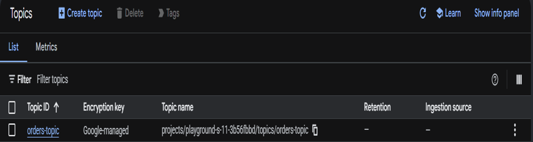
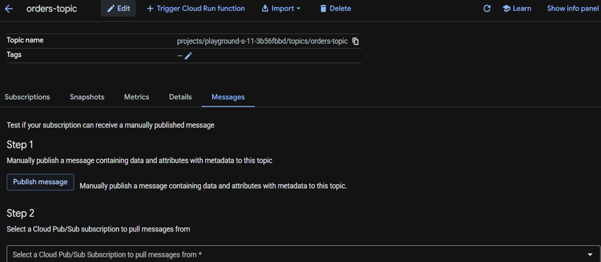
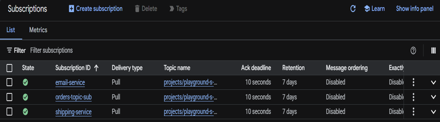
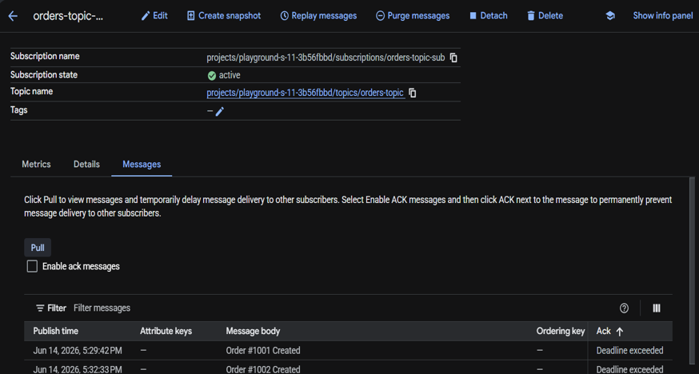

# Task 24 – Google Cloud Pub/Sub & Event-Driven Architecture

## Objective

Learn how Google Cloud Pub/Sub enables **asynchronous communication** between distributed applications by publishing and consuming messages through Topics and Subscriptions.

## Real-World Scenario

Many cloud applications do not communicate directly with one another.
Instead of waiting for another service to respond, applications exchange messages asynchronously.

For example, when a customer places an order on an e-commerce platform, several independent services may need to react:
- Order Service
- Payment Service
- Inventory Service
- Shipping Service
- Email Service

Rather than each service calling the next one directly, the application publishes an event such as: Order Created

Other services subscribe to that event and process it independently. This architecture is faster, more scalable, and more resilient than tightly coupled communication.

## Google Cloud Services Used

- Google Cloud Pub/Sub
- Topics
- Subscriptions
- Message Publishing
- Message Consumption

## Implementation Steps

### Step 1 – Create a Topic

Navigate to: Pub/Sub | Create a new Topic. Topic name: orders-topic

The Topic acts as the communication channel for published messages.

### Step 2 – Create a Subscription

Open the **orders-topic**. Create a Subscription | Subscription name: email-service

The subscription will receive copies of messages published to the Topic.

### Step 3 – Publish a Message

Open the Topic. Navigate to: Messages | Select **Publish Message**. Message body: Order #1001 created

Publish the message.

### Step 4 – Pull the Message

Open the **email-service** subscription | Navigate to: Messages

Select **Pull Messages** |The subscription should receive: Order #1001 created

### Step 5 – Create a Second Subscription

Create another Subscription. Subscription name: shipping-service

Publish another message to the Topic. Message body: Order #1002 created

### Step 6 – Pull Messages from the Second Subscription

Open the **shipping-service** subscription. Pull the available messages. The subscription should receive: Order #1002 created

This demonstrates that multiple independent subscribers can consume messages published to the same Topic.

## Key Concepts Learned

### Google Cloud Pub/Sub

Google Cloud Pub/Sub is a fully managed messaging service that enables asynchronous communication between distributed systems.
Applications publish messages to Topics, while Subscribers receive and process those messages independently.
This architecture promotes scalability, loose coupling, and fault tolerance.

### Event-Driven Architecture

Event-driven systems communicate by exchanging events instead of making direct service-to-service calls. 

A typical workflow is: Application -> Publish Event -> Pub/Sub Topic -> Multiple Subscribers -> Independent Processing

Each service reacts only when it receives a relevant event.

### Real-World Analogy

A useful analogy is YouTube notifications.

Creator -> Uploads Video -> YouTube -> Subscribers Receive Notifications

The creator does not contact every subscriber individually.

Similarly, in Pub/Sub: Publisher -> Topic -> Subscribers

Messages are delivered automatically to interested subscribers.

### Topics

A Topic is the communication channel where publishers send messages.
It does not process messages itself; it simply receives and distributes them to subscribed consumers.
Think of a Topic as an empty mailbox waiting to receive messages.

### Subscriptions

A Subscription receives copies of messages published to a Topic.
Multiple subscriptions can be attached to the same Topic, allowing different services to process the same event independently.

### Publishing Messages

Publishing sends a message from a producer application to a Topic. For example: Order #1001 created

The Topic distributes the message to all subscribed consumers.

### Pulling Messages

Subscribers retrieve messages from their subscriptions.
Each subscriber processes messages independently, enabling multiple services to react to the same event without directly communicating with one another.

## Outcome

Successfully explored Google Cloud Pub/Sub by creating Topics and Subscriptions, publishing messages, retrieving messages from multiple subscribers, and understanding how asynchronous messaging enables scalable, loosely coupled, event-driven cloud applications.

## Skills Practiced

- Google Cloud Pub/Sub
- Event-Driven Architecture
- Topics
- Subscriptions
- Message Publishing
- Message Consumption
- Asynchronous Communication

## Screenshots

