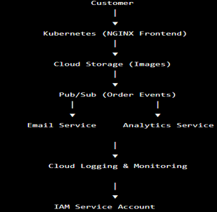
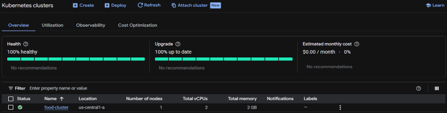
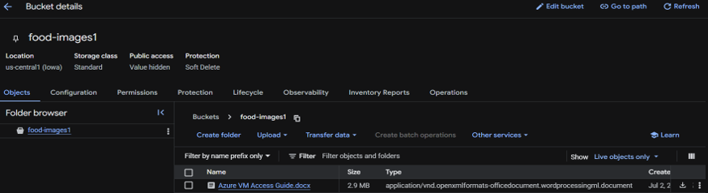
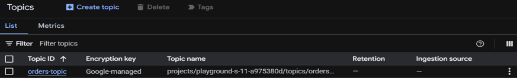
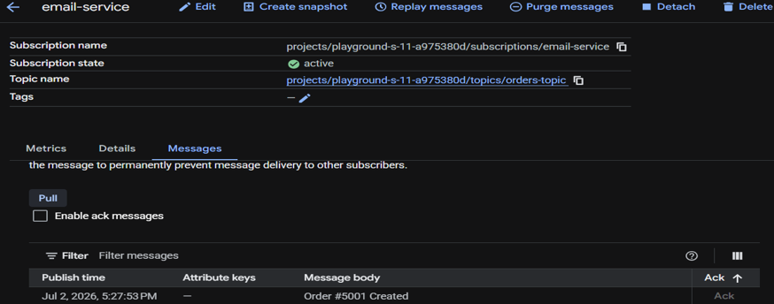
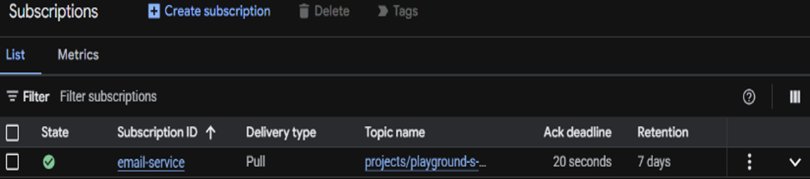
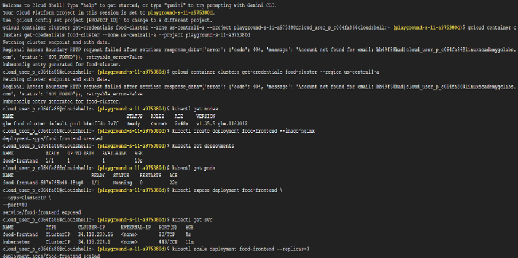
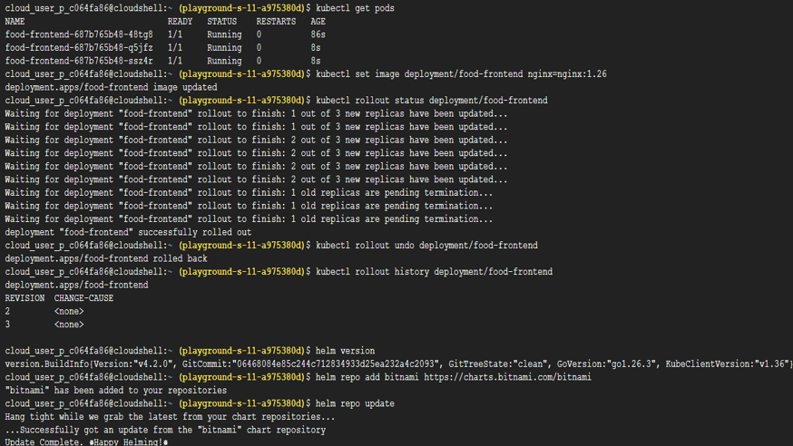
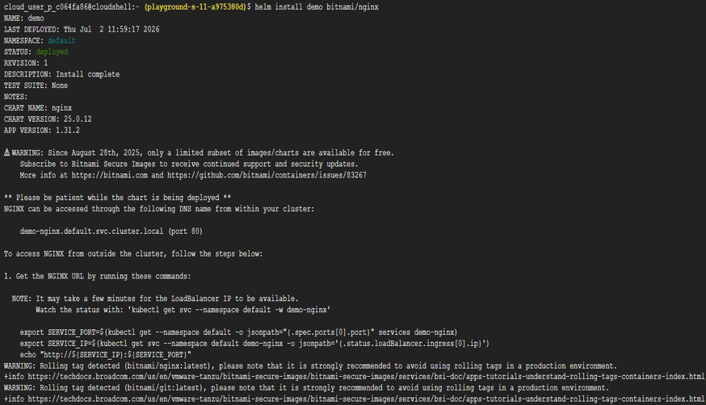
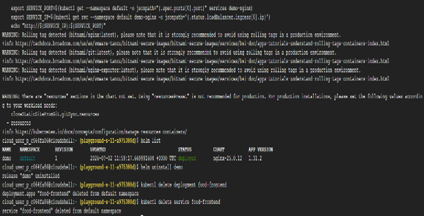

# Task 25 – End-to-End Cloud-Native Application Deployment on Google Cloud

## Objective

Bring together the core concepts learned throughout the learning journey by deploying a simplified cloud-native application on Google Cloud using Kubernetes, Pub/Sub, Helm, Cloud Storage, Monitoring, IAM, and other cloud-native services.

## Real-World Scenario

Imagine you have joined **Accenture** as a **Cloud Native Developer**. A client wants to migrate their **Food Ordering Website** from a traditional infrastructure to **Google Cloud Platform**.
Your team is responsible for deploying and managing the application using modern cloud-native technologies.
The architecture combines multiple Google Cloud services to build a scalable, secure, and maintainable application platform.

## Google Cloud Services Used

- Google Kubernetes Engine (GKE)
- Cloud Storage
- Cloud Pub/Sub
- Helm
- Cloud Monitoring
- Cloud Logging
- IAM
- Service Accounts
- Cloud Shell
- kubectl

## Architecture Overview

A simplified cloud-native architecture consists of:

                     Users
                       │
                       ▼
		Kubernetes Service
                       │
                       ▼
	     GKE Frontend Pods (NGINX)
	               │
	  ┌────────────┴────────────┐
	  │                         │
	  ▼                         ▼
      Cloud Storage             Pub/Sub Topic
     (Static Images)          (Order Events)
                                    │
                                    ▼
                        Email Service Subscriber
              Monitoring & Logging observe the entire application

Applications authenticate securely using Google Cloud Service Accounts.

## Implementation Steps

### Step 1 – Create a Kubernetes Cluster

Create a new GKE cluster. Cluster name: food-cluster

Connect Cloud Shell to the cluster. Verify the connection | kubectl get nodes

### Step 2 – Create a Cloud Storage Bucket

Create a Cloud Storage bucket. Example: food-images-<unique-name>

Upload any sample image to the bucket. In a production application, the frontend would retrieve static assets such as product images from Cloud Storage.

### Step 3 – Deploy the Frontend Application

Deploy an NGINX container to simulate the client website | kubectl create deployment food-frontend --image=nginx

Verify the deployment | kubectl get deployments

Verify the running Pods | kubectl get pods

### Step 4 – Expose the Application

Expose the deployment using a Kubernetes Service | kubectl expose deployment food-frontend --type=ClusterIP --port=80

Verify the Service | kubectl get svc

This simulates exposing the frontend application within the Kubernetes cluster.

### Step 5 – Scale the Application

Increase the number of application replicas | kubectl scale deployment food-frontend --replicas=3

Verify the Pods | kubectl get pods

Scaling enables the application to handle additional user traffic.

### Step 6 – Simulate an Application Update

Update the container image | kubectl set image deployment/food-frontend nginx=nginx:1.26

Watch the rollout | kubectl rollout status deployment/food-frontend

This demonstrates how Kubernetes performs rolling updates with minimal downtime.

### Step 7 – Roll Back the Deployment

Simulate reverting a failed deployment | kubectl rollout undo deployment/food-frontend

View the rollout history | kubectl rollout history deployment/food-frontend

Rollback allows production systems to quickly recover from unsuccessful releases.

### Step 8 – Configure Pub/Sub Messaging

Create a Topic. orders-topic | Create a Subscription. email-service

Publish a message. Order #5001 Created

Pull the message from the subscription. This simulates asynchronous communication between application services whenever a customer places an order.

### Step 9 – Deploy an Application Using Helm

Verify Helm | helm version

Add the Bitnami repository | helm repo add bitnami https://charts.bitnami.com/bitnami

Update the repository | helm repo update

Install the NGINX Chart | helm install demo bitnami/nginx

Verify the installation | helm list

Helm automates the deployment of Kubernetes resources without manually creating multiple YAML files.

### Step 10 – Explore Monitoring and Logging

Open: 
- Cloud Monitoring
- Cloud Logging
  
Observe the available dashboards and log entries. These services help engineers monitor application health and troubleshoot production issues.

### Step 11 – Create a Service Account

Create a Service Account. Example: food-app-sa

Applications should authenticate using Service Accounts instead of personal user accounts to follow security best practices.

### Step 12 – Clean Up Resources

Uninstall the Helm release | helm uninstall demo

Delete the deployment | kubectl delete deployment food-frontend

Delete the Service | kubectl delete service food-frontend

Finally, delete the Kubernetes cluster from the Google Cloud Console.

## Key Concepts Learned

### End-to-End Cloud-Native Architecture

A modern cloud-native application combines multiple managed cloud services to build scalable, resilient, and secure systems.
Rather than relying on a single server, different services perform specialized responsibilities.

### Kubernetes

Google Kubernetes Engine hosts and manages containerized applications. Kubernetes handles:
- Scheduling
- Scaling
- Self-healing
- Rolling updates
- Service networking

### Cloud Storage

Cloud Storage stores static application assets such as:
- Images
- Documents
- Videos
- Frontend resources

This separates static content from application servers.

### Pub/Sub

Pub/Sub enables asynchronous communication between microservices.
Instead of directly calling one another, services publish events that interested subscribers consume independently.
This reduces coupling between application components.

### Helm

Helm simplifies Kubernetes application deployment by packaging Kubernetes resources into reusable Charts.
Applications can be installed, upgraded, rolled back, and removed with simple commands.

### Monitoring & Logging

Cloud Monitoring provides operational metrics such as:
- CPU usage
- Memory utilization
- Availability

Cloud Logging centralizes logs from applications and infrastructure to support troubleshooting and incident analysis.

### IAM & Service Accounts

Applications should authenticate using dedicated Service Accounts instead of personal user credentials.
This follows the principle of least privilege and improves security in production environments.

### Cloud-Native Deployment Workflow

A typical production workflow follows these stages:

1. Infrastructure is defined using **Terraform**.
2. Applications are containerized using **Docker**.
3. Container images are stored in **Artifact Registry**.
4. Applications are deployed to **Google Kubernetes Engine (GKE)**.
5. Services are managed using **Helm**.
6. Workloads scale manually or automatically using **Horizontal Pod Autoscaler (HPA)**.
7. Microservices communicate through **Google Cloud Pub/Sub**.
8. Operations teams monitor applications using **Cloud Monitoring** and **Cloud Logging**.
9. IAM and **Service Accounts** provide secure authentication and authorization.

Together, these technologies form the foundation of modern cloud-native application development and operations.

## Outcome

Successfully simulated the deployment of a cloud-native food ordering application by integrating Kubernetes, Cloud Storage, Pub/Sub, Helm, Monitoring, Logging, and IAM services while understanding how these components work together to support scalable, secure, and production-ready applications on Google Cloud Platform.

## Skills Practiced

- Google Kubernetes Engine (GKE)
- Kubernetes
- Cloud Storage
- Google Cloud Pub/Sub
- Helm
- Cloud Monitoring
- Cloud Logging
- IAM
- Service Accounts
- Cloud-Native Architecture
- Application Deployment
- kubectl

## Screenshots

